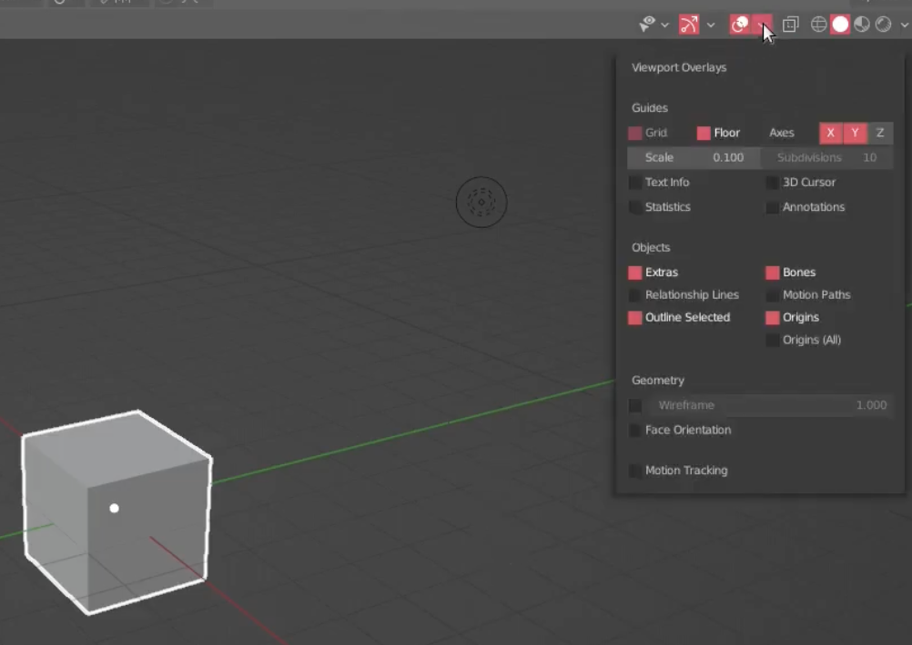
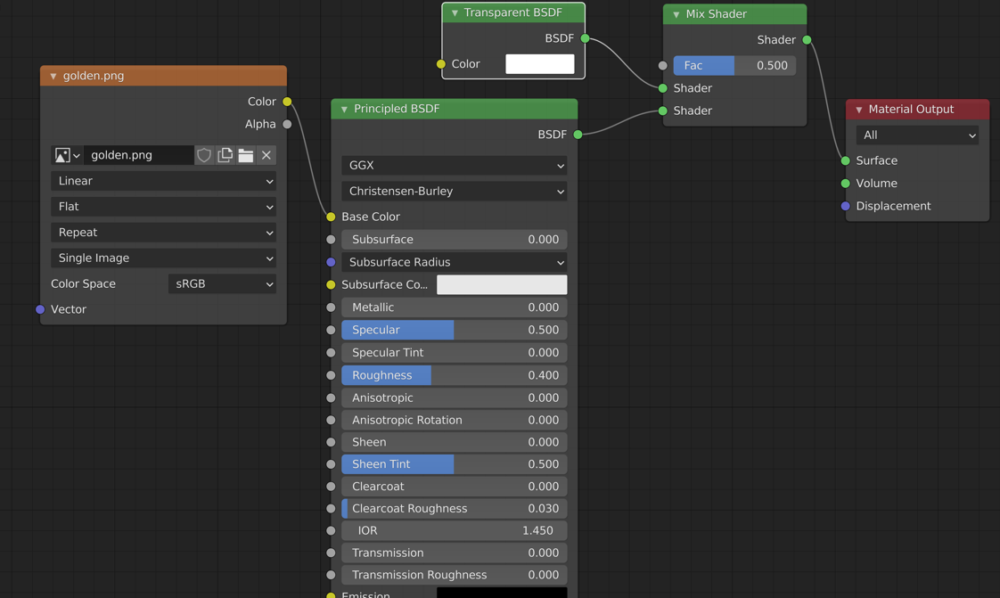
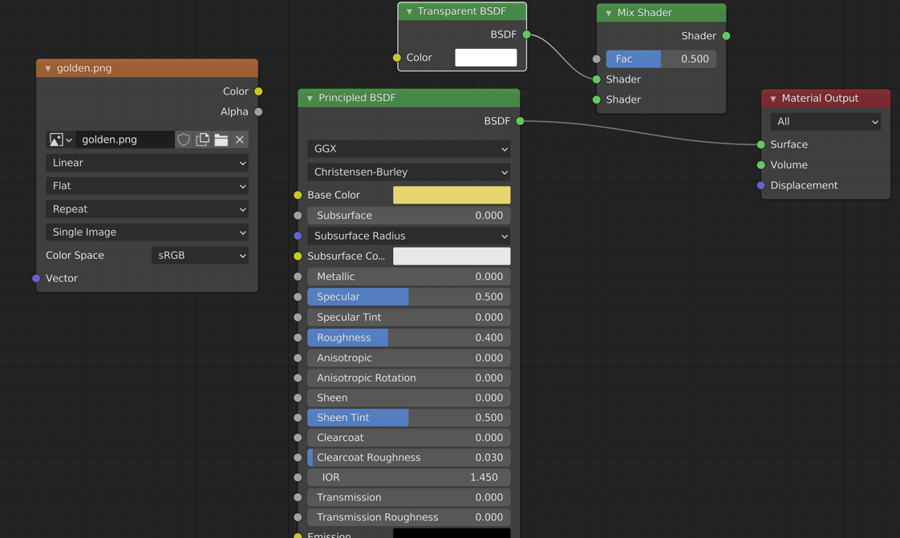
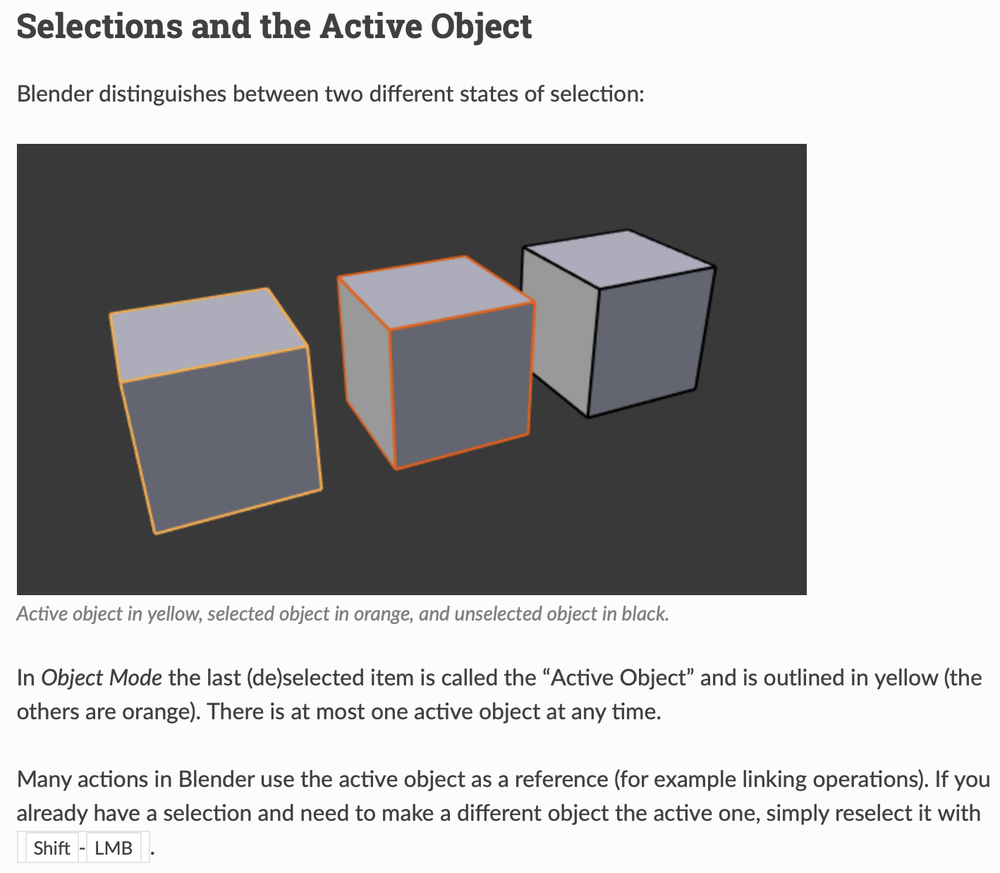
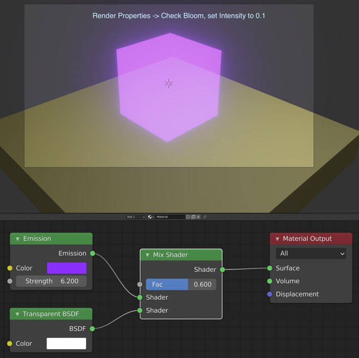

{{TOC}}

# Information

[What is a .blend1 file and why do you (not) need them?](https://cgcookie.com/articles/what-is-a-blend1-file-and-do-you-really-need-them)

# Basics

[How to Use Blender without a Middle Mouse Button or a Scroll Wheel](https://www.blenderhut.com/use-blender-without-middle-mouse-button-or-scroll-wheel/)  
&nbsp;&nbsp;&nbsp;&nbsp;Edit &rarr; Preferences &rarr; Input &rarr; click `Emulate 3 Button Mouse`

## Viewport navigation

[Viewport Navigation - Blender 2.80 Fundamentals](https://www.youtube.com/watch?v=ILqOWe3zAbk&list=PLa1F2ddGya_-UvuAqHAksYnB0qL9yWDO6&index=2)

### Selecting 

- Select - click object
- Unselect - click empty space
- `a` - select all
- `option-a` - deselect all
- `x` - delete whatever is selected

### Navigation

- Use tiny buttons along right upper edge of main window or XYZ stick axes
- Zoom in and out - click on tiny magnifier icon and move trackpad finger up or down OR cmd and 2 fingers on trackpad
- Rotate - option with 1 finger on trackpad OR 2 fingers unclicked on track pad
- Move - shift-option with 1 finger clicked on mousepad
- Recenter on selected object(s) - View menu &rarr; Frame Selected
- **Set viewport to be the same as the active camera**
    - `View` &rarr; `Cameras` &rarr; `Active Camera` (same as Numpad 0, but I don't have a number pad)

## Interface

[Interface Overview - Blender 2.80 Fundamentals](https://www.youtube.com/watch?v=8XyIYRW_2xk&list=PLa1F2ddGya_-UvuAqHAksYnB0qL9yWDO6&index=3)

- Strip along bottom of window says what mouse keys will do
- Upper right smaller window region &rarr; Selectable editor region.
- Toolbar along left side &rarr; `t` (for tools) to toggle it being visible or not
- With cursor anywhere in viewport, hit `shift-space` and will bring up tool bar as a pop-up menu
- Click `n` and toolbar will pop out of upper right side with object transformation settings
- Pie menus? Around 3:50 in video

[Select & Transform - Blender 2.80 Fundamentals](https://www.youtube.com/watch?v=hTL6AKR8YDs&list=PLa1F2ddGya_-UvuAqHAksYnB0qL9yWDO6&index=5)

## Duplication

- 2 finger click on object, which brings up a popup menu
- Select `Duplicate`
- Single finger drag away from original object and you'll have a 2nd object that you can place
- To more finely position object when it is selected, go into Object Properties and type in coordinates for x, y, z

## More in-depth info on using GUI and keyboard interface

[[2.92] Blender Tutorial: Quick Physics Simulation for Beginners](https://www.youtube.com/watch?v=ymhEH-shXMo) - great illustration of **how to manually interact with, duplicate, and modify objects and the timeline**. Also very good introduction to using the physics engine.

- `G` - grab object, it will now move with the mouse
- `S` - scale object, it will scale as move mouse
- `Shift-A` - brings up menu to add an object

## Python Scripting

- [Blender Tutorial - Animating With Python, UNLOCK the power](https://www.youtube.com/watch?v=QnvN1dieIAU)
    - &#x2605; Edit &rarr; Preferences &rarr; Interface &rarr; click on Python Tooltips checkbox - when hover over something in one of the windows, popup tooltip shows python statement for that thing.  See 16:20 in video.
    - &#x2605; In REPL, start typing command and after typing a `.` or any other character, hit `tab` and it will show all of the possible commands or completions of what you have started typing.
    - 19:00 - right click on something in the interface and select `Copy data_path` to get the data_path text you need to set this parameter in an argument list.
- Start Blender from the terminal command line so that print statements will put their output in this terminal window: `/Applications/Blender.app/Contents/MacOS/Blender &`
- Select `Scripting` from menu along top left of window. This puts the interface into a scripting-friendly state.
- Click on the `+ New` button of the Text Editor to bring up a new text editor window.
- Type `print('hello world')` in text editor.
- Run by clicking the run icon of the Text Editor or hitting `option-p` (`alt-p` on Windows) while mouse is anywhere within text editor window.
- &#x2605; [Create 3D objects and animations in Blender with Python API](https://demando.se/blogg/post/dev-generating-a-procedural-solar-system-with-blenders-python-api/)
- `import bpy`
    - `bpy.context`: it contains getters and readers on read-only values that describe your current working context or even the area (i.e. the panel in your window) that is currently being accessed
    - `bpy.data`: it gives you access to the resources in your scene (the objects, the materials, the meshes…) so you can load, add or delete them
    - `bpy.ops`: that’s the real meat of the API – it’s what allows you to perform actions and call operators on your objects or your views; it’s basically how you can simulate user actions via scripting (like selecting an object, entering edit mode, applying subdivisions, changing to “flat” shading, maximising a window…)
- Start Blender from the command line: `/Applications/Blender.app/Contents/MacOS/Blender &`

## Use external code editor

- [Blender docs - Use an External Editor](https://docs.blender.org/api/current/info_tips_and_tricks.html#use-an-external-editor)
    - In Blender in a python editor window, reference and execute external script `myscript.py` relative to the blend-file:

            import bpy
            import os
            
            filename = os.path.join(os.path.dirname(bpy.data.filepath), "myscript.py")
            exec(compile(open(filename).read(), filename, 'exec'))
    
- Use VS Code as the external editor
    - Set up to do autocomplete
        - Follow [Using Microsoft Visual Studio Code as external IDE for writing Blender scripts/add-ons](https://b3d.interplanety.org/en/using-microsoft-visual-studio-code-as-external-ide-for-writing-blender-scripts-add-ons/) "How to enable the autocomplete for Blender API in Visual Studio Code" using [Korchy/blender_autocomplete](https://github.com/Korchy/blender_autocomplete).

## Animation

- &#x2605; [How to Make an Object Fade in/out in Blender (Tutorial)](https://www.youtube.com/watch?v=3QjN693Gzwo)
- [Fade In – Fade Out Effects in Blender](https://prosperocoder.com/posts/blender/fade-in-fade-out-effects/)
- &#x2605; [Olav3D Tutorials](https://www.youtube.com/c/Olav3D/search?query=keyframe)
    - [[2.8] Blender Tutorial: Simple Animation For Beginners](https://www.youtube.com/watch?v=Dyj0sJVd3Lw) &rarr; importance of keyframes to animate objects (transition between 2 states or positions), using physics for motion
    - [How to Code 3D Objects From Scratch With Blender and Python](https://www.youtube.com/watch?v=tsmkqU25_As) &rarr; excellent
    - [How to Select And Transform Objects With Python in Blender](https://www.youtube.com/watch?v=VAmNUSUdVA0) &rarr; excellent
    - [[2.79] Tutorial: 3D Animation With Python and Blender](https://www.youtube.com/watch?v=ssHiWpVuxTk) &rarr; note older version of Blender so interface is not the same but can figure it out
- [Create 3D objects and animations in Blender with Python API](https://demando.se/blogg/post/dev-generating-a-procedural-solar-system-with-blenders-python-api/)
- With cursor over 3D view, hit `space` to toggle animation running

**Turn png image file sequence into a video**

Very easy: [[2.8] Blender Tutorial: How to Convert Images from Renders into Videos - Olav3D](https://www.youtube.com/watch?v=vO7Cndxkx08)  
[How To Turn Transparent PNGs into Videos With Transparency - Olav3D](https://www.youtube.com/watch?v=rKSykH1HZ3M)

---

# Log

## Thursday, 2021-09-02

- Go through [Create 3D objects and animations in Blender with Python API](https://demando.se/blogg/post/dev-generating-a-procedural-solar-system-with-blenders-python-api/), which is excellent!
    - Complete through Step 4 adding sun and radius rings
    - Complete Step 5, shader and materials for planets etc.
    - Complete Step 6, animating the planets
    - Complete Step 7, autocleaning the scene
    - Complete Step 8, Auto-setting scene properties, render engine, the 3D view settings

## Friday, 2021-09-03

**Objective**: Create 3D stacked rectangular-like objects and animate fade in.  
**Result**: Basic success with some caveats as noted in "Observations".

Rectangular layer-like object centered at `(x,y) = (0,0)` with bottom at `z=0`:
    
    xy_layer_size = 10
    z_layer_size = 0.5
    layer_scale = (1, 1, z_layer_size / xy_layer_size)
    
    layer = bpy.ops.mesh.primitive_cube_add(
        size=xy_layer_size, 
        scale=layer_scale, 
        location=(0, 0, z_layer_size/2)
    )

When re-run script, need to get rid of objects and materials created in previous runs. Run the following code at the beginning of the script to do that:

    def clean_up():
        # Delete materials from last time script ran
        original_materials = ['Dots Stroke', 'Material']
        for mat in bpy.data.materials:
            print(mat.name)
            if mat.name not in original_materials:
                bpy.data.materials.remove(mat)
        # Delete objects from last time script ran
        for obj in bpy.data.objects:
            obj.select_set(True)
            bpy.ops.object.delete(use_global=False)
            
    clean_up()

Couldn't figure out [f-curves (see Blender documentation)](https://docs.blender.org/manual/en/latest/editors/graph_editor/fcurves/introduction.html) in the time available.  

Instead, go through &#x2605; &#x2605; [Color Animation in Blender with Python](https://prosperocoder.com/posts/blender/color-animation/), which is excellent and just what I need for now. Try it out and the colors of a slice continuously change between specified colors. Then change some of the colors to have `alpha=0` and observe that both the colors and transparency fade in and out.

Next, start new Blender file, `210903_python_3D_layer_alpha_animate.blend`, to create layers and fade them in. Do the following:

- Create code to make a single layer and fade it in. 
- Pull layer and material code into for loop.
- Create 4 layers

**Observations**:

- Can see outlines of layers during whole animation, need to eliminate
- Last part of each layer animation is jerky
- Need to change camera position
- Change light position?

Found [Blender Tutorial - Animating With Python, UNLOCK the power](https://www.youtube.com/watch?v=QnvN1dieIAU), which is really good.

## Saturday, 2021-09-04

**To do**

- &#9989; Create a rendered video and see if it has outlines of layers in it and if last part of each animation is jerky
    - &#10060; If everything is great, proceed to make a better animation for conventional 3D printing with layers.
    - &#9654; If problems still exist:
        - How eliminate object outlines for transparent objects?
        - How remove jerky transparency animation &rarr; use a different interpolation? How?
- Remove background and make it all black or all white?

**Things I tried**

Use solution at [How to set camera location in the scene while pointing towards an object with a fixed distance](https://blender.stackexchange.com/questions/100414/how-to-set-camera-location-in-the-scene-while-pointing-towards-an-object-with-a) to set camera distance from origin, looking at the origin in `210903_python_3D_layer_alpha_animate.blend`. **Works well.**

With the camera in the right position, now try rendering a video. To make the render process go much faster, do the following in the output panel:

- Change video resolution to 720x480 (width x height) from 1920x1080.
- Change file format to Movie &rarr; FFmpeg Video
- Change container to MPEG-4
- Make sure video codec is H.264

Next, go to Layout workspace and select View &rarr; Viewport Render Animation. This will render the animation. I did a bunch of other stuff and there was only a static image of the final scene for all of the frames in the output (don't use from the main menu Renderer &rarr; Render Animation). Some good points can be found here, but not the last step as I just noted: [[2.8] Blender : How to Render an Animation in EEVEE](https://www.youtube.com/watch?v=nQXQCT_hKSs).

- Change resolution back to 1920x1080
- Choose AVI JPEG file format
- Set quality to 100%
- Other settings: 24 fps and render frames 1 to 250

**Results**:

- avi output file is 199 MB! But it renders pretty fast (much, much faster than mpeg-4).
- Transparent layers still have outlines
- Final part of each layer fade-in is still jerky
- Bottom of 2nd layer is banded, but not other layers
    - Try changing Postprocessing &rarr; Dither from 1.0 to 2.0, but it doesn't help
- All rendered videos are in `/tmp`

Go through [https://docs.blender.org/manual/en/latest/render/output/animation.html](https://docs.blender.org/manual/en/latest/render/output/animation.html) and learn about workflows - the Direct Approach and the Frame Sequence approach.

**Turn off grid and XY lines**

In the Layout workspace before rendering, click on `Floor` and `X`,`Y` in the dropdown menu as in the image below. Also turn off `Origins` to eliminate the little dot that denotes the center of each object.

**Try more things**

- In `210903_python_3D_layer_alpha_animate.blend`, create `frame_pairs_for_layers` in a for loop with programmatic specification of number of layers and fade-in times

        start_frame = 10
        num_fadein_frames = 15
        num_frames_between_fadeins = 20
        num_layers = 5
        frame_pairs_for_layers = []
        for i in range(num_layers):
            base_frame = start_frame + i * (num_fadein_frames + num_frames_between_fadeins)
            frame_pairs_for_layers.append(
                (base_frame, base_frame + num_fadein_frames)
            )
        print(frame_pairs_for_layers)
        
        # Print output: [(10, 25), (45, 60), (80, 95), (115, 130), (150, 165)]

- In `Output Properties` reduce number of frames from 250 to 185

**Next**

- Create a 90&deg; channel bend 3 layers tall where channel can be seen on the two visible layer stack faces. 
    - Need function(s) that can create and place the necessary layer shapes for each exposure region.
        - How create an L-shaped 3D object?
    - How group them together to have joint keyframes? No &rarr; as shown in [Blender Tutorial - Animating With Python, UNLOCK the power](https://www.youtube.com/watch?v=QnvN1dieIAU), you can just programmatically give objects the same keyframe times.
- Animate the following cases:
    - Conventional 3D printing method
    - Reduced edge dose like we presented in 2017 paper (actually, there we increased the edge dose)
        - Reduced dose in layers above channel?
    - Reduced layer thickness along channel edges embedded in 10 &mu;m bulk layers, which is the full generalized 3D printing method in our Nature Communications paper
- &#10060; Have an underlying surface on which to build the layers that is always visible? This is basically replacing the grid with a solid surface.

## Monday, 2021-09-06

Try basics of running an external script file within Blender with `210906_use_external_script_file.blend` and `210906_use_external_script_file.py` and set up VS Code to do blender autocompletes.

## Saturday, 2021-09-11

**To do**

- &#9989; Run code from 2021-09-03 in external file edited with VS Code and produce a video to make sure full workflow still works.
- &#9989; Increase number of layers and change camera position to accommodate.
- Start to do L-shaped channel animation.

**Run 2021-09-03 from external file and produce a video**

- Move code verbatim to external python file.
- Start new blender file, go to Scripting workspace, create edit window, paste in short code to execute external python file.

Create video. Do next operations within Blender.

- Go to Animation workspace
- In output pane:
    - Keep 1920x1080 resolution
    - Choose AVI JPEG file format
    - Set quality to 100%
    - Other settings: 24 fps and render frames 1 to 170
- In Layout workspace turn off grid, XY lines, and origin (center points of objects)
    - Set viewport to be same as active camera: `View` &rarr; `Cameras` &rarr; `Active Camera`
    - `View` &rarr; `Viewport render animation`. **Works**.
- Select `Render` &rarr; `Render Animation`. It goes a lot slower than the preview method and creates a movie file with a static image. Why???
    - [Blender Eevee Tutorial: Animation and Render](https://www.youtube.com/watch?v=9817LRCcnYk) at about 8:40-9:05 shows how to change interpolation between keyframes. Timeline &rarr; Dope Sheet &rarr; turn off "Only show selected" arrowhead so that all of the keyframes are shown on the timeline. Then select an object &rarr; Channel &rarr; Extrapolation mode &rarr; Linear Extrapolation (`bpy.ops.action.extrapolation_type(type='LINEAR'`). I've tried figuring out how to set this programmatically with python, but no luck for now. I need to move on.
    - [Eevee render not looking same as my viewport!](https://www.reddit.com/r/blender/comments/iioc2m/eevee_render_not_looking_the_same_as_my_viewport/g380a7d/) - good thread.
- Change output folder for rendered animations to `~/Downloads/renderings` from `/tmp`

**Data structures and algorithm**

    Create z positions as floats
    Use each z position as a key in a dict
    For each key, have a list of objects, each with their own material
    Create a list of frame index tuples like [(frame0, frame1), (frame2, frame3), ...]
    Create objects and put them into the appropriate z position's list in the dict
    Loop over the dict

Or:
    
    dict:
    {z_position_1: {
        'objects': [],
        'beginning_frame': XX,
        'ending_frame': YY
        }
    }

Or:
    
    class Layer:
        z_position
        objects
        beginning_frame
        ending_frame
    Create list of objects ordered by increasing z position
    Loop over the list, setting keyframes and colors?

Or:
    
    class animated_object:
        object with its material
        set keyframes and colors
        
Hmm, trying things out and the `mesh.primitive_cube_add()` is problematic. Need alternatives.

- [Boolean difference modifier](https://docs.blender.org/manual/en/latest/modeling/modifiers/introduction.html#example)
- [How to join objects with Python?](https://blender.stackexchange.com/questions/13986/how-to-join-objects-with-python)
- [Shadows on alpha channel PNG's and eevee](https://blender.stackexchange.com/questions/123607/shadows-on-alpha-channel-pngs-and-eevee) &rarr; uses Alpha Clip mode instead of Alpha Blend

Learn how to difference 2 objects: [Boolean difference not making any diiference (Python scripting)](https://blender.stackexchange.com/questions/48160/boolean-difference-not-making-any-diiference-python-scripting) - **very good**. Implement it in `210911_difference_two_objects.blend`.

**Use different method of making a 3D layer object that gets ride of the scaling problem I was having by creating a primitive cube with no arguments and then changing its `.scale` property, followed by changing its `.location` property to put it where I want it.**

**I now have successful boolean difference to create channel layers**.

**To do**

- Problem with `clean_up` where it crashes on objects that are unlinked. **Need to fix.**
    - [How to delete object from scene through the Blender Python API](https://b3d.interplanety.org/en/how-to-delete-object-from-scene-through-the-blender-python-api/)
    - in code, print objects in for loop.
    - Delete by hand?
- Still need to figure out how to render animation rather than viewport render animation.

## Monday, 2021-09-13

[2.91 Python API No change after applying boolean modifier operator](https://blender.stackexchange.com/questions/196816/2-91-python-api-no-change-after-applying-boolean-modifier-operator).

- Implement the code in the final answer and see how it works. Works fine. Moves subtractive objects so they are not in the View Layer.
- Add my `clean_up()` code and it deletes objects in View Layer and then crashes:

        Info: Deleted 3 object(s)
        Traceback (most recent call last):
          File "/Users/nordin/Documents/Projects/notes_to_self/Blender/210913_stackexchange_example_difference.blend/Text", line 151, in <module>
          File "/Users/nordin/Documents/Projects/notes_to_self/Blender/210913_stackexchange_example_difference.blend/Text", line 147, in clean_up
        RuntimeError: Error: Object 'attach_hulls' can't be selected because it is not in View Layer 'View Layer'!

[How to use alpha transparent textures in Blender](https://artisticrender.com/how-to-use-alpha-transparent-textures-in-blender/). See section: "What is the differences between blend modes in Eevee?". Need to use `Alpha Blend`.

[Shader Nodes &rarr; Introduction](https://docs.blender.org/manual/en/latest/render/shader_nodes/introduction.html)

>An important concept to understand when building node setups is that of the shader socket. The output of all surface and volume shaders is a shader, describing lighting interaction at the surface or of the volume, rather than the color of the surface.

>There are a few types of shaders available as nodes:

>BSDF shader  
Describe light reflection, refraction and absorption at an object surface.

>Emission shader  
Describe light emission at an object surface or in a volume.

>Volume shader  
Describe light scattering inside a volume.

>Background shader  
Describe light emission from the environment.

>Each shader node has a color input, and outputs a shader. These can then be mixed and added together using Mix and Add Shader nodes. No other operations are permitted. The resulting output can then be used by the renderer to compute all light interactions, for direct lighting or global illumination.

Specific shaders

[Transparent BSDF](https://docs.blender.org/manual/en/latest/render/shader_nodes/shader/transparent.html) - *used to add transparency without refraction, passing straight through the surface, as if there were no geometry there. ... Note that only pure white transparent shaders are completely transparent.*

[Principled BSDF](https://docs.blender.org/manual/en/latest/render/shader_nodes/shader/principled.html) - *combines multiple layers into a single easy to use node.*

[Specular BSDF](https://docs.blender.org/manual/en/latest/render/shader_nodes/shader/specular_bsdf.html) - Eevee Only - *combines multiple layers into a single easy to use node.*

[Mix Shader](https://docs.blender.org/manual/en/latest/render/shader_nodes/shader/mix.html) - *used to mix two shaders together.*

# Tuesday, 2021-09-14

## Using nodes for material and shading with transparency

&#x2605; Watch [Blender 2.9+ Basic Material Transparency](https://www.youtube.com/watch?v=esIKF8WvaVg) from [Basic Alpha Transparency](https://www.katsbits.com/codex/alpha/#blender-29-transparency).

- Go to Shading workspace
- Select `Display render preview` in main 3D window
- Mix Shader Fac: 0.5
- Transparent BSDF (T-BSDF) Color: White
- Principled BSDF (P-BSDF):
    - In Shading workspace, add Texture &rarr; Image Texture and choose image `golden.png`.
    - **Vary Alpha to control transparency**
- Material Settings:
    - Blend Mode: Alpha Blend
    - Shadow Mode: None &rarr; critical
    - `Show Backface` makes object semi-transparent (i.e., can partially see through to backfaces of object) when Alpha set to 1.0. Uncheck and object is transparent but can't see backfaces of object, can see things behind the object. 

Principled and Transparent BSDF into Mix Shader with image texture:  
  
Principled with base color and Transparent BSDF into Mix Shader:  
  
Principled BSDF with base color only:  
  

### What I've learned:

1. For P-BSDF and T-BSDF put through a Mix Shader (with texture image):
    - Mix Shader Fac controls the ultimate transparency when P-BSDF Alpha &rarr; 1.0.
    - Show Backface does exactly what it says. When checked, Backface Culling removes backface so it looks the same as if Show Backface is unchecked. 
2. For P-BSDF with texture image:
    - Varying Alpha changes the overall transparency of the object
    - Absolutely turn off Show Backface!
3. For P-BSDF with manually set Base Color (no texture image):
    - Varying Alpha changes the overall transparency of the object
    - Absolutely turn off Show Backface!
    - **So, same as if use a texture image**

## Transparency animation fixing all of my previous problems

- Use #3 above (only P-BSDF with manually set Base Color)
- Set 3D view Viewport Shading in upper right corner to `Display render preview`
- Manually add keyframes at frames 1, 30, 45 with Alpha = 1, 0.023, 0.87, respectively
- In `Output Properties` set `File Format` to `AVI JPEG` and End frame to 65
- View &rarr; Viewport Render Animation &rArr; Good animation!
- Render &rarr; Render Animation &rArr; **Good animation from camera perspective!**
    - No evidence of edge lines
    - Smooth fade-in and fade-out animation with no jerk at end of coming to full transparency

# Wednesday, 2021-09-15

Look up information about creating materials in Blender with Nodes:

- [Transparent material in Blender in render mode (Eevee or Cycles) in Python, Blender 2.93 [closed]](https://blender.stackexchange.com/questions/234268/transparent-material-in-blender-in-render-mode-eevee-or-cycles-in-python-blen)
- [Principled BSDF via Python API](https://blender.stackexchange.com/questions/160042/principled-bsdf-via-python-api)
- [Adding new Principled BSDF materials using python scripting](https://stackoverflow.com/questions/63098407/adding-new-principled-bsdf-materials-using-python-scripting)

# Thursday, 2021-09-16

## Info

&#x2605; [Blender 3D — How to create and render a scene in Blender using Python API, by Armindo Cachada | Jun 7, 2021](https://spltech.co.uk/blender-3d%E2%80%8A-%E2%80%8Ahow-to-create-and-render-a-scene-in-blender-using-python-api/) - *In this article, I will show you how you can create a scene in Blender, using the Python 2.93 Blender API.* - Cube, plane, light source, camera and constraining camera to point at an object (very easy to do).

## Task

### Objective

Create from scratch entire scene (light, camera, layers (no channels), materials) from python. When re-run script, delete everything and start fresh.

Info:

    Camera
    Location: 16.344, -15.382, 11.012
    Rotation (XYZ Euler): 63.9, 0.0, 46.7
    
    Light
    Point, 1000 W, Diffuse = Specular = Volume = 1.0, Radius = 0.1 m
    Location: 4.0762, 1.0055, 5.9039
    # These are degrees and must be converted to radians!
    Rotation (XYZ Euler): 37.3, 3.16, 107 

### Files
  
`210916_uniform_layers_with_materials.py`, `210916_uniform_layers_with_materials.blend`

Try to get `clean_up()` to work, but after an hour it won't so give up and delete everything manually in between runs of the script.

Success making a camera, light source, single layer with Principled BSDF that renders.

# Friday, 2021-09-17

Learn how to set a material's blend mode, shadow, and showing backface from python code.

## Play with light sources

Some reasonable combinations (all sources are at the location and angles mentioned 9/16/21 above.

**Sun**  
Strength: 1.8
Diffuse: 1.0  
Specular: 0.4  
Volume: 1.0  
Angle: 0.526 deg

**Sun** - gives better side coverage on the left side  
Strength: 2.5
Diffuse: 1.0  
Specular: 0.4  
Volume: 1.0  
Angle: 135 deg

**Point**  
Power: 1000  
Diffuse: 1.0  
Specular: 1.0  
Volume: 1.0  
Radius: 0.25 m  

**Area**  
Power: 800  
Diffuse: 1.0  
Specular: 0.2  
Volume: 1.0  
Shape: Square  
Size: 5 m  

To get properties of a light object, in the Blender terminal execute, for example:

    >>> dir(bpy.data.lights['Light_sun'])
    ['__doc__', '__module__', '__slots__', 'angle', 'animation_data', 'animation_data_clear',
     'animation_data_create', 'asset_data', 'bl_rna', 'color', 'contact_shadow_bias',
     'contact_shadow_distance', 'contact_shadow_thickness', 'copy', 'cutoff_distance',
     'cycles', 'diffuse_factor', 'distance', 'energy', 'evaluated_get', 'is_embedded_data', 
     'is_evaluated', 'is_library_indirect', 'library', 'make_local', 'name', 'name_full', 
     'node_tree', 'original', 'override_create', 'override_library', 
     'override_template_create', 'preview', 'rna_type', 'shadow_buffer_bias', 
     'shadow_buffer_clip_start', 'shadow_buffer_samples', 'shadow_buffer_size', 
     'shadow_cascade_count', 'shadow_cascade_exponent', 'shadow_cascade_fade', 
     'shadow_cascade_max_distance', 'shadow_color', 'shadow_soft_size', 'specular_factor', 
     'tag', 'type', 'update_tag', 'use_contact_shadow', 'use_custom_distance', 
     'use_fake_user', 'use_nodes', 'use_shadow', 'user_clear', 'user_of_id', 'user_remap', 
     'users', 'volume_factor']

To create a light and set its properties in python code in the external file:

    light_data = bpy.data.lights.new("Light_sun", type="SUN")
    light = bpy.data.objects.new("Light_sun", light_data)
    bpy.context.collection.objects.link(light)
    light.location = light_location
    light.rotation_euler = light_rotation
    light.data.energy = power
    light.data.specular_factor = 0.4
    light.data.angle = angle * pi / 180.0

Create functions to make Sun, Area, and Point lights.

# Saturday, 2021-09-18

## First steps

First, edit my workflow notes and document using 3D View render preview from camera perspective.

Next, refactor `210916_uniform_layers_with_materials.py` and add docstrings to light object creation functions.

## Object-Material relationships in python using Blender console

Use the `Scripting` workspace and go to the `Console` window. I already have an object defined, `Test_layer`, that has a material, `Layer_material`. Use knowledge of python and Blender API to explore objects and materials and their relationships:

    # Objects
    >>> bpy.data.objects
    <bpy_collection[3], BlendDataObjects>
    >>> bpy.data.objects.items()
    [('camera', bpy.data.objects['camera']), ('Light_sun', bpy.data.objects['Light_sun']), ('Test_layer', bpy.data.objects['Test_layer'])]

    # Materials
    >>> bpy.data.materials
    <bpy_collection[3], BlendDataMaterials>
    >>> bpy.data.materials.items()
    [('Dots Stroke', bpy.data.materials['Dots Stroke']), ('Layer_material', bpy.data.materials['Layer_material']), ('Material', bpy.data.materials['Material'])]
    
    # Test_layer
    >>> bpy.data.objects['Test_layer']
    bpy.data.objects['Test_layer']
    
    # 3 ways to access its material
    >>> bpy.data.objects['Test_layer'].data.materials.items()
    [('Layer_material', bpy.data.materials['Layer_material'])]
    >>> bpy.data.objects['Test_layer'].data.materials[0]
    bpy.data.materials['Layer_material']
    >>> bpy.data.objects['Test_layer'].active_material
    bpy.data.materials['Layer_material']
    
    # Set up variables for layer and its material to make things more concise
    >>> layer = bpy.data.objects['Test_layer']
    >>> layer.active_material
    bpy.data.materials['Layer_material']
    >>> mat = layer.active_material
    >>> mat
    bpy.data.materials['Layer_material']
    >>> mat_nodes = mat.node_tree.nodes
    >>> mat_nodes
    bpy.data.materials['Layer_material'].node_tree.nodes
    >>> mat_nodes.items()
    [('Principled BSDF', bpy.data.materials['Layer_material'].node_tree.nodes["Principled BSDF"]), ('Material Output', bpy.data.materials['Layer_material'].node_tree.nodes["Material Output"])]
    
    # Variable for material's alpha parameter to control transparency
    >>> mat_nodes["Principled BSDF"].inputs["Alpha"]
    bpy.data.materials['Layer_material'].node_tree.nodes["Principled BSDF"].inputs[19]
    >>> mat_alpha_param = mat_nodes["Principled BSDF"].inputs["Alpha"]
    >>> mat_alpha_param
    bpy.data.materials['Layer_material'].node_tree.nodes["Principled BSDF"].inputs[19]
    >>> mat_alpha_param.default_value
    1.0
    >>> mat_alpha_param.default_value = 0.5
    >>> mat_alpha_param.default_value
    0.5

**Note, when doing this in the Blender interactive python console, *ALL* objects to which the material is attached change instantly in the 3D View render preview mode to any change in material parameters.**

## Animate fade-in for single layer

&#x2605; Good information on how to animate the transparency of a material associated with an object: [Has there been an issue with keyframing the alpha channel of a material when rendering in the GPU since 2.9.0?](https://blender.stackexchange.com/questions/237583/has-there-been-an-issue-with-keyframing-the-alpha-channel-of-a-material-when-ren). Read the `animate_alpha()` function definition. **Key idea: Call `.keyframe_insert("default_value", frame=NN)` on Principled BSDF alpha parameter after setting alpha parameter.** Example:

    layer = bpy.data.objects['Test_layer']
    mat = layer.active_material
    mat_nodes = mat.node_tree.nodes
    mat_alpha_param = mat_nodes["Principled BSDF"].inputs["Alpha"]
    mat_alpha_param.default_value = 0.0
    mat_alpha_param.keyframe_insert("default_value", frame=1)
    mat_alpha_param.default_value = 1.0
    mat_alpha_param.keyframe_insert("default_value", frame=30)

Move alpha animation code to a function. Also create a helper function to convert time in seconds to frames:

    def animate_object_transparency(
        obj, start_frame, end_frame, initial_value=0.0, final_value=1.0
    ):
        """Given an object with an active material that uses nodes and has a Principled BSDF node,
        create keyframes to animate the object's transparency (alpha value) from an initial to a
        final value.
    
        Args:
            obj (Blender object - bpy_types.Object): Object to animate transparency
            start_frame (int): Frame on which to start animation
            end_frame (int): Frame on which to end animation
            initial_value (float, optional): Starting alpha value. Defaults to 0.0.
            final_value (float, optional): Ending alpha value. Defaults to 1.0.
        """
        mat = obj.active_material
        mat_nodes = mat.node_tree.nodes
        mat_alpha_param = mat_nodes["Principled BSDF"].inputs["Alpha"]
        mat_alpha_param.default_value = initial_value
        mat_alpha_param.keyframe_insert("default_value", frame=start_frame)
        mat_alpha_param.default_value = final_value
        mat_alpha_param.keyframe_insert("default_value", frame=end_frame)

    frames_per_second = 24
    
    def frame_number(time_seconds, frames_per_second=frames_per_second):
        """Utility function to calculate the frame number for a particular time
        given the anticipated frames per second for the animation.
    
        Args:
            time_seconds (float or int): time in seconds to convert to frames
            frames_per_second (float or int): number of frames per second in animation
        """
        return round(frames_per_second * time_seconds)

    start_frame = 1
    end_time_seconds = 1.0
    end_frame = frame_number(end_time_seconds)
    animate_object_transparency(layer, start_frame, end_frame)

## Refactor material creation into a function

    def make_material_Principled_BSDF(name, color_RGB):
        """Create a Pincipled BSDF material.
    
        Args:
            name (str): Name to give new material
            color_RGB (3-element tuple or list of floats): RGB color (each element is in range of 0.0 to 1.0))
    
        Returns:
            [type]: [description]
        """
        mat = bpy.data.materials.new(name=name)
        mat.use_nodes = True
        mat_nodes = mat.node_tree.nodes
        # Set Principled BSDF values
        mat_nodes["Principled BSDF"].inputs["Metallic"].default_value = 0.0
        mat_nodes["Principled BSDF"].inputs["Roughness"].default_value = 0.4
        mat_nodes["Principled BSDF"].inputs["Base Color"].default_value = (
            *color_RGB,
            1.0,
        )
        # Change material settings for blend method, show backface, shadow mode
        mat.blend_method = "BLEND"
        mat.show_transparent_back = False
        mat.shadow_method = "NONE"
        return mat

Usage:

    layer = make_layer(
        "Test_layer", xy_layer_size, xy_layer_size, z_layer_size, z_position=0.0
    )
    layer.data.materials.append(
        make_material_Principled_BSDF("Material_00", color_RGB_default)
    )

## Create video of bulk layer creation

Looks great--nicely animated with no artifacts. 5 layers.

Possible improvements or things to try:

- Outline each layer (static) so that animation fills in the layers
    - Right now there is no visual cue for layers after they fade in
- Alternatively, slant each layer edge so the edgefaces of the 3D print have a serrated look
- Different number of layers:
    - 2 uniform base layers
    - 4 channel layers
    - 3 roof layers, 20 of which have reduced exposure over the channel
    - &rarr; 9 layers total, would need to adjust camera distance

## Set render animation parameters from python

Get frames per second from Blender file:

    frames_per_second = bpy.data.scenes["Scene"].render.fps

Set last frame to render for animation:

    last_frame = frame_number(end_time + 0.3)
    bpy.data.scenes["Scene"].frame_end = last_frame

## Add layers, adjust camera

Create new files: `210918_channel_animation.py`, `210918_base_blender_file.blend`.

Change to 9 3D printed layers and change camera location and direction to nicely center final 9-layer stack:

    Camera
    Location: 21.247, -19.997, 14.316
    Rotation (XYZ Euler): 66.7, 0.0, 46.7
    
## Create video of channel creation

Add `make_channel_layer()` function and use it in the layer for loop.

## Move light source further away by factor of 2

    Light
    Location: 8.1524, 2.0110, 11.808
    # These are degrees and must be converted to radians!
    Rotation (XYZ Euler): 37.3, 3.16, 107 

## How do secondary images in one layer?

One possibility:

- Have primary and secondary image objects, each with different colors.
- Transition both from transparent to secondary image color.
- Then transition primary object from secondary image color to primary image color.

## Error applying boolean difference and fix for it

    Traceback (most recent call last):
      File "/Users/nordin/Documents/Projects/notes_to_self/Blender/210918_base_blender_file.blend/Text", line 11, in <module>
      File "/Users/nordin/Documents/Projects/notes_to_self/Blender/210918_channel_animation_secondary_image.py", line 330, in <module>
        bpy.ops.object.modifier_apply(modifier=mod.name)
      File "/Applications/Blender.app/Contents/Resources/2.93/scripts/modules/bpy/ops.py", line 132, in __call__
        ret = _op_call(self.idname_py(), None, kw)
    RuntimeError: Operator bpy.ops.object.modifier_apply.poll() failed, context is incorrect
    Error: Python script failed, check the message in the system console

**Solution**: It works if the primary object for the difference operation is the active object, which is different than being the selected object. See below for what this means and how to set the active object.

[Active object vs selected object](https://docs.blender.org/manual/en/latest/scene_layout/object/selecting.html):

To select an object: `obj.select_set(True)`.  
To set active object: `bpy.context.view_layer.objects.active = obj`.  
To check which object is active from Blender console: `bpy.context.active_object` (this is a read-only parameter and cannot be direction set--use the command in the previous line so set the active object).  
See [Set active object with python](https://blender.stackexchange.com/questions/78359/set-active-object-with-python).  

## Animate edge dose for channel layers

`210918_channel_animation_secondary_image.py` - **Success!**

### Colors

Use [Color Calculator - Sessions College](https://www.sessions.edu/color-calculator/) to get complementary colors.  
Also use [RGB to HEX Color Converter](https://www.rgbtohex.net) and [Hex to RGB Color Converter](https://www.rapidtables.com/convert/color/hex-to-rgb.html)  

    Primary:  
    Golden - RGB (1.0, 0.71, 0.2) = (255, 180, 51) = HEX #FFB433  
    Complementary: 
    Greenish - RGB (0.2, 1.0, 0.71) = (51, 255, 180) = HEX #33ffb4
    Purple - RGB (0.71, 0.2, 1.0) = (180, 51, 255) = HEX #b433ff  

<svg xmlns="http://www.w3.org/2000/svg" width="780" height="140" viewBox="0 0 780 140">
    <g fill="none" fill-rule="evenodd">
        <rect id="#ffb433" width="140" height="140" x="0" fill="#ffb433"/>,<rect id="#33ffb4" width="140" height="140" x="160" fill="#33ffb4"/>,<rect id="#b433ff" width="140" height="140" x="320" fill="#b433ff"/>
    </g>
</svg>

From [Data Color Picker, powered by Learn UI Design](https://learnui.design/tools/data-color-picker.html), here are 5 nice colors together:

    #003f5c - Teal-ish
    #58508d - Purple-ish
    #bc5090 - Lavender-ish
    #ff6361 - Orangey-pinkish
    #ffa600 - Golden

 #003f5c, #58508d, #bc5090, #ff6361, #ffa600

<svg xmlns="http://www.w3.org/2000/svg" width="780" height="140" viewBox="0 0 780 140">
    <g fill="none" fill-rule="evenodd">
        <rect id="#003f5c" width="140" height="140" x="0" fill="#003f5c"/>,<rect id="#58508d" width="140" height="140" x="160" fill="#58508d"/>,<rect id="#bc5090" width="140" height="140" x="320" fill="#bc5090"/>,<rect id="#ff6361" width="140" height="140" x="480" fill="#ff6361"/>,<rect id="#ffa600" width="140" height="140" x="640" fill="#ffa600"/>
    </g>
</svg>

# Monday, 2021-09-20

## Grow object in z from 2D, make visible and invisible

[How to hide a certain object in blender 2.8?](https://blender.stackexchange.com/questions/133468/how-to-hide-a-certain-object-in-blender-2-8): `bpy.context.object.hide_set(True)`.

`210920_manual_animate_growing_cube_in_z_and_object_disappear_reappear.blend` 

- Animate a layer growing from 0 to final thickness in z.
    - Have to simultaneously increase thickness and move upward in z.
- Animate an object disappearing and reappearing.
    - From one frame to another change all 3 scale values to 0 to disappear, and do the reverse to reappear. 
        - `user2658640`'s answer for Blender 2.9 at [How to make an object invisible at a particular keyframe without moving it in Blender (2.59)?](https://stackoverflow.com/questions/8844389/how-to-make-an-object-invisible-at-a-particular-keyframe-without-moving-it-in-bl)
    - How keep track of the objects scale values to reapply them? Create a class that keeps track of them? Use composition, not inheritance. Can also add method to class to do the keyframing animation. 

## Python class with animation methods

`210920_python_class_with_animation_methods.py` - develop class `Animated3DObject`.

- Successfully implemented fade-in and fade-out.  
- Successfully implemented disappear and reappear.  

`210918_channel_animation_secondary_image.py`

- Copy `Animated3DObject` and convert `bulk` case to use it successfully
- Use for `channel` case
- Use for `channel with edge dose` case

# Tuesday, 2021-09-21

[[2.92] Blender Tutorial: Quick Physics Simulation for Beginners](https://www.youtube.com/watch?v=ymhEH-shXMo) - great illustration of how to manually interact with, duplicate, and modify objects and the timeline. Also very good introduction to using the physics engine.

`210918_channel_animation_secondary_image.py`

- Put edge layer creation into a function
- Do case with reduced roof dose and channel edge dose

# Wednesday, 2021-09-22

## Do case with small channel edge layers and reduced roof dose

Approach: Do channel animation where channel edges are comprised of 3 smaller layers. Plan:

`210918_channel_animation_secondary_image.py`

- Create first small edge layer at z = z0.
- Animate it going to small edge color (and have it take less time than a full layer).
- Create 2nd small edge layer at z = z0 + z_layer/3
- Animate it going to small edge color (and have it take less time than a full layer).
- Create 2rd small edge layer at z = z0 + z_layer/3
- Create eroded channel layer
- Animate both of these going to small edge color
- Then animate eroded channel layer going to bulk layer color

## Make semi-transparent material

**See [p2or/blender-generate-mix-shader-example.py](https://gist.github.com/p2or/1ffcd6ed57bc8d857afbd3659c9a0089) for example how to create material with python.**

### Blender scripting window

In Blender scripting window from default new file:

    # Get Blender default object
    >>> cube =  bpy.data.objects['Cube']
    >>> cube
    bpy.data.objects['Cube']
    
    # Get default material and nodes
    >>> cube.active_material
    bpy.data.materials['Material']
    >>> mat = cube.active_material
    >>> mat
    >>> mat_nodes = mat.node_tree.nodes
    >>> mat_nodes.items()
    [('Material Output', bpy.data.materials['Material'].node_tree.nodes["Material Output"]),
     ('Principled BSDF', bpy.data.materials['Material'].node_tree.nodes["Principled BSDF"])]
    
    # Set color
    >>> mat_nodes['Principled BSDF'].inputs["Base Color"].default_value = [0.2, 0.0, 0.8, 1.0]
        
    # Add Transparent Shader and Mix Shader
    >>> mat_nodes.new(type="ShaderNodeBsdfTransparent")
    bpy.data.materials['Material'].node_tree.nodes["Transparent BSDF"]
    >>> mat_nodes.new(type="ShaderNodeMixShader")
    bpy.data.materials['Material'].node_tree.nodes["Mix Shader"]
    >>> mat_nodes.items()
    [('Transparent BSDF', bpy.data.materials['Material'].node_tree.nodes["Transparent BSDF"]),
    ('Principled BSDF', bpy.data.materials['Material'].node_tree.nodes["Principled BSDF"]),
    ('Material Output', bpy.data.materials['Material'].node_tree.nodes["Material Output"]),
    ('Mix Shader', bpy.data.materials['Material'].node_tree.nodes["Mix Shader"])]

    # Set shader positions in Shader View window
    >>> mat_nodes['Transparent BSDF'].location = (-10, 500)
    >>> mat_nodes['Transparent BSDF'].location
    Vector((-6.449999809265137, 500.0))
    >>> mat_nodes['Principled BSDF'].location =  (-10, 350)
    >>> mat_nodes['Mix Shader'].location =       (310, 430)    
    >>> mat_nodes['Material Output'].location =  (530, 300)

    # Create node shortcuts
    >>> node_mix = mat_nodes['Mix Shader']
    >>> node_mix
    bpy.data.materials['Material'].node_tree.nodes["Mix Shader"]
    >>> node_output = mat_nodes["Material Output"]
    >>> node_prin = mat_nodes['Principled BSDF']
    >>> node_tran = mat_nodes['Transparent BSDF']
    
    # Create links between nodes
    >>> links = mat.node_tree.links
    >>> link_mix_out = links.new(node_mix.outputs[0], node_output.inputs[0])
    >>> link_prin_mix = links.new(node_prin.outputs[0], node_mix.inputs[1])
    >>> link_tran_mix = links.new(node_tran.outputs[0], node_mix.inputs[2])
    
    # Change material settings to get nice transparency
    >>> mat.blend_method = "BLEND"
    >>> mat.show_transparent_back = False
    >>> mat.shadow_method = "NONE"

    # Change Mix Shader mixing factor 
    # (0 is all Principled BSDF, 1 is all Transparent Shader)
    >>> node_mix.inputs['Fac'].default_value = 0.3

### In python file

`210918_channel_animation_secondary_image.py`

- Make function `make_material_Principled_and_Transparent_BSDF()` and try it with only 20% transparency mixed in.

### Conclusion

A semi-transparent material does not look good. Opaque is much better.

# Thursday, 2021-09-23

Get feedback from my group on animations. See notes under `Next` below.

Try 60 fps. I can't really tell a difference with 24 fps.

## Use parent object to move multiple objects together

`210923_manual_parent_object.blend`

- Start with default new file with cube.
- Manually create 2nd object, a cylinder. Make sure it is selected.
- Hold down shift key and select cube. Cube is outlined yellow (indicating it's the ACTIVE object) while the 2nd object is outlined in orange (indicating it's just selected).
- From `Object` menu, select `Parent` &rarr; `Object`. The 2nd object is now a child of the Cube.
- Manually create a 3rd object, a sphere. Make sure only it is selected.
- Hold down shift key and select cube. Cube is ACTIVE, sphere is SELECTED.
- From `Object` menu, select `Parent` &rarr; `Object`. The 3rd object is now a child of the Cube. Note that is at the same child level as the 2nd object (i.e., both the 2nd and 3rd objects are children of the Cube object).
- Create 2 more cubes, select them, then select the original cube, create a parent relationship, the new cubes are children just like the cylinder and sphere
- When I manually select and move just the original cube, everything else moves with it, maintaining the same spatial relationships to Cube.
- Now confirm I can move all of the object together by just moving Cube. Create a python script edit window with the following code. Change the location values and run the code (`option-p`) and watch all of the objects change position accordingly.

        import bpy
        
        cube = bpy.data.objects['Cube']
        cube.location = (0, 0, 3)

## Animate growing cube in -z direction

`210923_animate_growing_cube_in_negative_z_then_move_down_and_do_another_layer.blend`

- First do this manually with default cube.
    - 2 keyframes at frame=1
        - location with z = 1.0
        - scale with z = 0.0
    - 2 keyframes at frame=40
        - location with z = 0.5
        - scale with z = 0.5
- Next, do it with python code (Note for all of the python code I manually set the material so it will have some color when looking with render preview):

        import bpy
        
        # Parameters
        x_layer_size, y_layer_size, z_layer_size = 8, 6, 1
        xy_location = (0, 9)
        start_frame = 20
        end_frame = 60
        
        # Create initial layer object
        bpy.ops.mesh.primitive_cube_add(size=1)
        layer = bpy.context.object
        layer.name = "Test"
        layer.scale = (0, 0, 0)
        layer.location = (*xy_location, z_layer_size)
        
        # Make layer appear at frame start_frame
        layer.keyframe_insert(data_path="scale", frame=start_frame-1)
        layer.scale = (x_layer_size, y_layer_size, 0)
        layer.keyframe_insert(data_path="scale", frame=start_frame)
        
        layer.keyframe_insert(data_path="scale", frame=start_frame)
        layer.keyframe_insert(data_path="location", frame=start_frame)
            
        layer.scale = (x_layer_size, y_layer_size, z_layer_size)
        layer.location = (*xy_location, z_layer_size / 2)
        
        layer.keyframe_insert(data_path="scale", frame=end_frame)
        layer.keyframe_insert(data_path="location", frame=end_frame)
 
    - Works great!
- Now add in movement down by 1 layer and create a 2nd layer - also works great:

        import bpy
        
        # Parameters
        x_layer_size, y_layer_size, z_layer_size = 8, 6, 1
        xy_location = (0, 9)
        start_frame = 20
        grow_duration = 40
        end_frame = start_frame + grow_duration
        move_down_delay = 10
        move_down_duration = 15
        between_layer_delay = 20
        
        # Create initial layer object
        bpy.ops.mesh.primitive_cube_add(size=1)
        layer = bpy.context.object
        layer.name = "Test"
        layer.scale = (0, 0, 0)
        layer.location = (*xy_location, z_layer_size)
        
        # Make layer appear at frame start_frame
        layer.keyframe_insert(data_path="scale", frame=start_frame-1)
        layer.scale = (x_layer_size, y_layer_size, 0)
        layer.keyframe_insert(data_path="scale", frame=start_frame)
        
        # Set up keyframes to start growing in -z
        layer.keyframe_insert(data_path="scale", frame=start_frame)
        layer.keyframe_insert(data_path="location", frame=start_frame)
        
        # Set up values and keyframes to define end of growth in -z
        layer.scale = (x_layer_size, y_layer_size, z_layer_size)
        layer.location = (*xy_location, z_layer_size / 2)
        layer.keyframe_insert(data_path="scale", frame=end_frame)
        layer.keyframe_insert(data_path="location", frame=end_frame)
        
        # Set start and end frames for -z move
        start_frame = end_frame +  move_down_delay
        end_frame = start_frame + move_down_duration
        
        # Move layer down by z_layer_size
        layer.keyframe_insert(data_path="location", frame=start_frame)
        current_z = layer.location[2]
        layer.location = (*xy_location, current_z - z_layer_size)
        layer.keyframe_insert(data_path="location", frame=end_frame)
        
        
        # Create 2nd layer object
        bpy.ops.mesh.primitive_cube_add(size=1)
        layer = bpy.context.object
        layer.name = "Test2"
        layer.scale = (0, 0, 0)
        layer.location = (*xy_location, z_layer_size)
        
        # Set start and end frames for 2nd layer
        start_frame = end_frame +  between_layer_delay
        end_frame = start_frame + grow_duration
        
        # Make layer appear at frame start_frame
        layer.keyframe_insert(data_path="scale", frame=start_frame-1)
        layer.scale = (x_layer_size, y_layer_size, 0)
        layer.keyframe_insert(data_path="scale", frame=start_frame)
        
        # Set up keyframes to start growing in -z
        layer.keyframe_insert(data_path="scale", frame=start_frame)
        layer.keyframe_insert(data_path="location", frame=start_frame)
        
        # Set up values and keyframes to define end of growth in -z
        layer.scale = (x_layer_size, y_layer_size, z_layer_size)
        layer.location = (*xy_location, z_layer_size / 2)
        layer.keyframe_insert(data_path="scale", frame=end_frame)
        layer.keyframe_insert(data_path="location", frame=end_frame)

## Make one object the parent of another

[How to make object A a parent of object B via Blender's Python API?](https://blender.stackexchange.com/questions/9200/how-to-make-object-a-a-parent-of-object-b-via-blenders-python-api)

- To prevent parent objects' location and scale transforms from being applied to the child (see Justa's answer at the above link):

        layer.parent = parent_layer
        layer.matrix_parent_inverse = parent_layer.matrix_world.inverted()

- Success moving both layers from above code together using:

        # We are going to use the first layer as the parent object
        parent_layer = bpy.data.objects['Test']
        
        # Set parent layer for the 2nd layer
        layer.parent = parent_layer
        layer.matrix_parent_inverse = parent_layer.matrix_world.inverted()
        
        # Move parent layer and confirm that child layer moves too
        start_frame = end_frame + move_down_delay
        end_frame = start_frame + move_down_duration
        # Move layer down by z_layer_size
        parent_layer.keyframe_insert(data_path="location", frame=start_frame)
        current_z = parent_layer.location[2]
        parent_layer.location = (*xy_location, current_z - z_layer_size)
        parent_layer.keyframe_insert(data_path="location", frame=end_frame)

# Friday, 2021-09-24

## Semi-transparent emissive object

See [Create 3D objects and animations in Blender with Python API](https://demando.se/blogg/post/dev-generating-a-procedural-solar-system-with-blenders-python-api/) for basics of creating an emissive object. Note the really nice material creation function.

Watch [Glow Objects in Blender in 2 minutes](https://www.youtube.com/watch?v=WTFj9B6eFgk) and learn how to make an object glow or bloom:

- Select on right of screen `Render Properties`
- Check box `Bloom`
- Increase its intensity (0.100)

`210924_emissive_semitransparent_object.blend` - Add Emission Shader, Transparent Shader, Mix Shader, and Ouput Material in the Shading view:

Nice combination:
    
    Emission
        Color: (0.08, 0.03, 1.0)
        Strength: 5
    Transparent BSDF
    Mix Shader
        Fac: 0.6

Make sure to turn on `Bloom` in `Render Properties` using python and set intensity:

    # Set up Rendering to use bloom
    bpy.context.scene.eevee.use_bloom = True
    bpy.data.scenes['Scene'].eevee.bloom_intensity = 0.1

Good function to create semi-transparent emission shader material:

    def create_semitransparent_emission_shader(name, color, strength=5, mix_fac=0.6):
        # Make sure color is RGBA
        if len(color) == 3:
            color = (*color, 1.0)
        assert len(color) == 4
        
        # Create a new material resource (with its associated shader)
        mat = bpy.data.materials.new(name)
        # Enable the node-graph edition mode
        mat.use_nodes = True
        
        # Clear all starter nodes
        nodes = mat.node_tree.nodes
        nodes.clear()
    
        # Add the Emission node
        node_emission = nodes.new(type="ShaderNodeEmission")
        node_emission.inputs[0].default_value = color
        node_emission.inputs[1].default_value = strength
        node_emission.location = (0, 0)
        
        # Add the Transparency node
        node_tran = nodes.new(type="ShaderNodeBsdfTransparent")
        node_tran.location = (0, -125)
        
        # Add the Mix node
        node_mix = nodes.new(type="ShaderNodeMixShader")
        node_mix.inputs[0].default_value = mix_fac
        node_mix.location = (200, 0)
        
        # Add the Output node
        node_output = nodes.new(type="ShaderNodeOutputMaterial")
        node_output.location = (400, 0)
        
        # link the two nodes
        links = mat.node_tree.links
        link_mix_out = links.new(node_mix.outputs[0], node_output.inputs[0])
        node_emission = links.new(node_emission.outputs[0], node_mix.inputs[1])
        link_tran_mix = links.new(node_tran.outputs[0], node_mix.inputs[2])
    
        # Change material settings for blend method, show backface, shadow mode
        mat.blend_method = "BLEND"
        mat.show_transparent_back = False
        mat.shadow_method = "NONE"
    
        return mat

## Refactor

`210918_channel_animation_secondary_image.py` and `blender_tools/`

- Move lights code to `blender_tools/lights.py`
- Move materials code to `blender_tools/materials.py`
- Move layer object code to `blender_tools/layer_objects.py`
- Move some animation code to `blender_tools/animation.py`

## Next:

- &#9989; Create different types of lights and play with parameters to get ones I like (point, area, sun) &rarr; go with sun
- &#9989; How programmatically create material from python?
- &#9989; Animate single layer fade in.
- &#9989; Animate sequential layers on top of each other, start with just bulk layers
- &#9989; Then apply to channel layers made with boolean difference operation
- &#9989; Move sun light source further away?
- &#9989; Do edge exposure case with secondary images
- &#9989; Develop `Animate3DObject` class with appear, disappear, fade-in, fade-out, and color change animation methods
- &#9989; Put `Animate3DObject` in `210918_channel_animation.py` so can do next bullet
- &#9989; Change edge exposure layers to get rid of artificial edge/bulk boundary
    - Create 3 layer objects:
        - Channel
        - Eroded channel
        - Edge
    - First, use channel and fade-in to edge dose color
    - Next, replace channel with eroded channel and edge objects at full edge dose color
    - Next, animate eroded channel from edge dose color to bulk color
- &#9989; Put edge layer creation into a function
- &#9989; Add roof exposures above channel
- &#9989; Do embedded different layer thicknesses and multiple exposure times
- Change from 24 fps to 30 fps?
- &#10060; Set AVI JPEG video quality to 100% with python
    - **No, going from 90% to 100% changes the file size from 32 MB to 269 MB!**
- &#9989; Try a semi-transparent material by using a Principled BSDF, Transparent BSDF, and Mix Shader &rarr; **does not look good**
- Feedback from my research group on 9/23/21:
    - Use darker colors for higher dose.
    - Add legend for colors and dose.
    - Render at 60 fps so the animation is smooth. Dallin found 24 fps to be choppy.
    - Chandler: in presentation, stop video after 2 layers and explain what is going on.
    - Adam: Possibly put video on a repeated loop.
    - Emma suggested having the layer grow in z rather than using a transparency fade-in, which is the same as the idea noted below.
- **IDEA: to create a layer, instead of using transparency fade-in, have it grow in the z direction (actually, -z direction), which is easy to animate**. 
    - You could also have the whole stack of layers move down between each grow operation (group already-visible layers into a collection and apply translation to collection as a whole?). Look at it from somewhat above, noting in presentation that the process actually happens upside down.
    - Also include a transparent violet representation of the photopolymerizing light that uses an emissive material so that it glows.
    - How have the whole stack move down? Attach each successive layer to the first layer with the first layer being the parent so that when the first layer moves, all of the other layers move too?
- &#10060; Do more complicated boolean difference operation to get 90&deg; channel bends?
- &#10060; Make layers visually apparent
    - Slant layer edges so 3D printed edgefaces have a serrated look?
    - Wireframe outline for each layer that fades in with the layer?
    - Or, have all layer outlines statically present throughout video such that they get successively filled in during the animation?
- &#10060; Rotate camera after 3D print completes to see how the object looks
- Do a more complicated microfluidic component, like a valve, or maybe half a valve so we can see the cross section?
