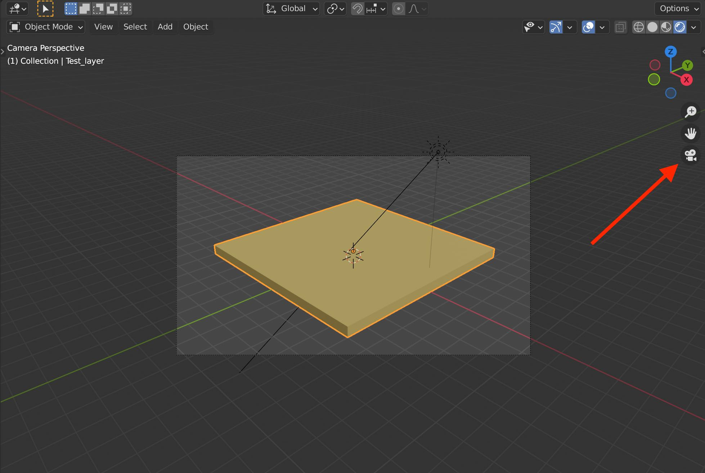

# Purpose

Document my Blender workflow as I develop it. In particular, keep this file updated to show my latest workflow so it is easy to reproduce.

# Set up

## Overview

Put python code in one or more text files external to Blender and execute them from within Blender by executing one main external text file that may import from other python modules (individual external files). The Blender file and external python files should all be in the same directory.

## Blender

See Blender documentation for your operating system to install Blender.

Blender: how ot use an external editor - [Blender docs - Use an External Editor](https://docs.blender.org/api/current/info_tips_and_tricks.html#use-an-external-editor)

## Install and set up VS Code

See VS Code documentation for how to install.

Set up VS Code to for Blender python autocomplete:

- Follow [Using Microsoft Visual Studio Code as external IDE for writing Blender scripts/add-ons](https://b3d.interplanety.org/en/using-microsoft-visual-studio-code-as-external-ide-for-writing-blender-scripts-add-ons/) "How to enable the autocomplete for Blender API in Visual Studio Code" using [Korchy/blender_autocomplete](https://github.com/Korchy/blender_autocomplete).

# Workflow

## Set up

- Start with a nearly blank Blender file that has no objects or materials but that has a short python script to read and execute an external python file.
    - To create blender file, create a new file and save it with some name, `my_file.blend`.
    - In Blender: 
        - Position mouse over 3D View window. 
        - Type `a`, which selects all objects (the Light, Cube, and Camera). 
        - Type `x` and hit return to delete all objects.
        - Click the `Scripting` tab to be in the scripting workspace.
        - At the top of the central window, click `+ New` to create a new text window.
        - Paste the following python code into the text window:

                import bpy
                import os
                
                filename = os.path.join(os.path.dirname(bpy.data.filepath), "my_file.py")
                exec(compile(open(filename).read(), filename, 'exec'))
            
        - In `Output Properties` tab on right side of window, do the following:
            - Set the Output folder to `~/Downloads/renderings/` instead of `/tmp/`
            - Set the File Format to `AVI JPEG`
        - Now you have a nearly blank Blender file with just this short python script.
    - In VS Code:
        - Create a new python file `my_file.py` in the same directory as `my_file.blend`.
        - Paste the following code into python file:

                import bpy
                from math import pi
                
                # Add blender file directory to the python path
                import sys
                blender_file_path = str(bpy.path.abspath("//"))
                if blender_file_path not in sys.path:
                    sys.path.append(blender_file_path)
                # print()
                # print(sys.path)

        - You can now import code from any python modules in the same directory and write code in this file that Blender will execute. If you have set up VS Code properly, you will have Blender code completions, which is extremely useful to explore Blender code possibilities and to remind you of syntax you've used or seen before but don't quite remember.
    - To execute external python code in `my_file.py` in Blender:
        - Click the `Scripting` tab to be in the scripting workspace.
        - With the mouse anywhere in the python text window, type `option p`, which executes the code in the python text window, which in turn executes the external python file.

## Process

- Execute external python file to try some Blender effect and determine what needs to change in the code to try next.
- Do not re-execute changed code in the same Blender file. Also, do not save the Blender file you just used.
- Instead, re-open original blender file and try new external python code again. You could possibly select all objects manually and the materials and delete them before running the modified external python code, but this seems to still build up different object and material names so it's better to not save the file you run the code in but just re-open the original nearly blank Blender file to have a fresh start for each time you run your code.
    - To make this faster, use these keyboard shortcuts:
        - `shift-cmd o` - Open recents
        - Hit return to select the most recent blender file
        - `d` - Don't save currently open file
        - With mouse in python script window in Scripting view, `option p` to run python code that runs the external python code file

## 3D View render mode

When you execute your python code, the 3D View window will be in `Display in solid mode`, which is denoted by the small button shown by the red arrow:  
  

Change this to `Display render preview`:
  
The reason for the change is that you can't see changes in material properties, such as the alpha value, in solid mode. You also can't see lighting effects. Therefore you need to be in render preview mode.

Also change to the camera view so that you know what your scene will look like when you ultimately render your animation:  
  

# How-to's

- To create Camera, Light, and material(s), use info in [Blender 3D — How to create and render a scene in Blender using Python API, by Armindo Cachada | Jun 7, 2021](https://spltech.co.uk/blender-3d%E2%80%8A-%E2%80%8Ahow-to-create-and-render-a-scene-in-blender-using-python-api/).