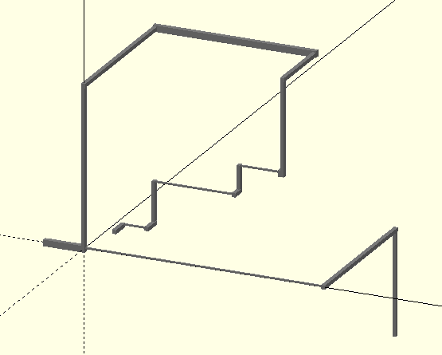

Written by: Jose Sanchez

## Routing:

### routing_181112.scad

	routing(p0 = p0,pf = pf,dimm = dimm, routing_color = "gray", endings = [[[0,0],[0,0],[0,0]],[[0,0],[0,0],[0,0]]],index = 0, sub_index = 0, def = [0,1,2]);

<b>Description:</b>

Connects points using "single-axis" channels.

<b>Inputs:</b>

- p0

		Initial 3D-point location
        p0 = [p0_x,p0_y,p0_z];
        
- pf
		
        Sequence of next points locations to be connected, types of channels and its dimmensions:
        pf = [pf0,pf1,pf2,...];
        
        Supported formats:
        
        pf0 = ["+x",50*px,0];
        //50_pixels-long x-channel with dimmensions = dimm[0], second point of the channel located +50*px in the x-direction respect to the previous point.
        
        pf1 = ["+y",-70*px,[3]];
        //70_pixels-long y-channel with dimmensions = dimm[3], second point of the channel located -70*px in the y-direction respect to the previous point.
        
        pf2 = ["+z",[-80*layer]];
        //80_layers-longz-channel with dimmensions = dimm[def[2]], second point of the channel located -80*layer in the z-direction respect to the previous point.
        
        pf3 = ["+xyzyz",[5*px,-7*px,10*layer,15*px,-5*layer]]
        //sequence of channels with different lengths and directions(sign), if you don't specify the dimmensions, the program uses the default ones. See "def" input below.
        
        pf4 = ["+xyzyz",[5*px,-7*px,10*layer,15*px,-5*layer],[0,1,3,4,2]]
        //if you specify the dimmensions ("dimm" indices), you should specify all of them
        
        pf5 = ["x",50*px]
        //x-channel, default dimmensions, second point with x-coordinate (x = 50*px) (the other coordinates are the same as the ones from the previous point)
        
        pf6 = ["y",point,5]
        //y-channel, with dimmensions = dimm[5], second point with y-coordinate (y = point[1]) (the other coordinates are the same as the ones from the previous point)
        
        pf7 = ["zxy",point]
        //sequence of channels (z-channel + x-channel + y-channel) with default dimmensions, and second points with coordinates: (z = point[2]), (x = point[0]), (y = point[1]) respectively (the other coordinates are the same as the ones from the previous points).
        
        The types or channels are inside (""), not ('').   
        
            
        
- dimm

		List of channel dimmensions used:
        dimm = [dimm_0,dimm_1,dimm_2,...];
        
        Each of the different channel dimmensions should have a very specific format:
        - For "x" channels:
          dimm_x = [[0,0],[y0,y1],[z0,z1]];
        - For "y" channels:
          dimm_y = [[x0,x1],[0,0],[z0,z1]];
        - For "z" channels
          dimm_z = [[x0,x1],[y0,y1],[0,0]];
          
        This NOT ONLY defines the dimmensions of the channels, BUT ALSO how they are located respect to the points to be connected. 
        For example:
        - dimm_x1 = [[0,0],[-w/2,w/2],[-h/2,h/2]];
        // It defines an 'x-axis' channel with cross section height = h, and width = w, whose central axis passes trough the points that it connects.
        - dimm_x2 = [[0,0],[-w/2,w/2],[0,h]];
        // It defines an 'x-axis' channel with cross section height = h, and width = w, whose central axis  is located h/2 above the points to be connected.
        
        All ranges should include 0, otherwise the channels are not going to pass through the points.
        
        
- routing_color
		
        Routed channels color
        Color "gray" by default
        
- endings:

		Dimmensions of the channels previous to the first point and subsequent to the last point.
        
- index
		
        Used for recursion. DO NOT MODIFY
        
- sub_index
		
        Used for recursion. DO NOT MODIFY
        
- def
		
        Sets the default dimmensions for channels.
        By default: def = [0,1,2]
        Which means that if the dimmension of channels are not specified:
        - dimm[def[0]] --> "x-axis" channels dimmensions
        - dimm[def[1]] --> "y-axis" channels dimmensions
        - dimm[def[2]] --> "z-axis" channels dimmensions

<b>Examples</b>

	pp = [200,150,200];  
	pp2 = [300,200,-100];

	p0 = [15,50,5];
	pf = [ 	["+y",25,1],
       		["+x",30],
        	["+y",20,1],
        	["+z",50,[2]],
        	["+xyzx",[100,15,30,50]],
        	["xz",pp,[3,2]],
        	["y",pp[2]],
        	["xyz",[0,0,0],[3,1,2]],
        	["x",-50,3],
        	["xyz",pp2],
        	["+z",-30,4]
	];
	dimm = [[[0,0],[-1,1],[0,2]],
         	[[-2.5,2.5],[0,0],[-2.5,2.5]],
         	[[-2,2],[-3,3],[0,0]],
         	[[0,0],[-3,3],[-4,4]],
         	[[-2,2],[-3,3],[0,0]]*0.8,
          ];   
   
	routing();    

  

  
  <b>Include</b>
  
  	include<routing_181112.scad>
        
      Note: The routing module uses another module called "channel" and a function called "xyz_idx" included in the same file.
      
   
   <b>Observations</b>
   
   When dealing with channels with width equal to an odd multiple of pixels (or height equal to an odd mulitple of layers), something like this can happen.
   
   

   
   In the image, each square represents a pixel, so the 3D-printed chip can actually end up having a channel of 6-pixels width (or 4 depending on how the slicer program generates the slices), instead of 5.
   
   The dimmensions input format helps solving this problem by allowing to define the channel in different ways respect to the points that they connect.
   
   

   
   <u>The program deals with the connections between channels (intersections) (otherwise there is a bug).</u>
   

   <b>Revision</b>
   
   I haven't tried all the main different input combinations possible to see if there is any bug, but it seems to be working correctly until now (11-13-18).