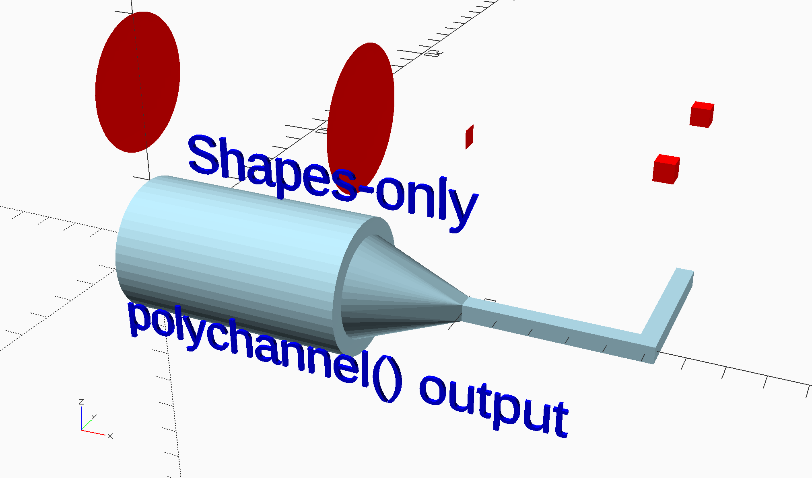
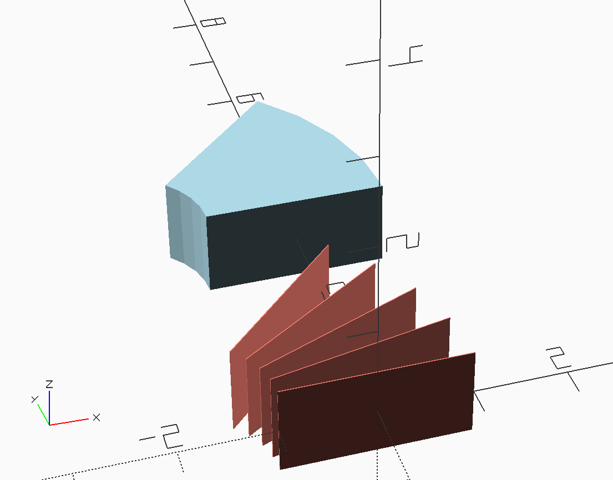
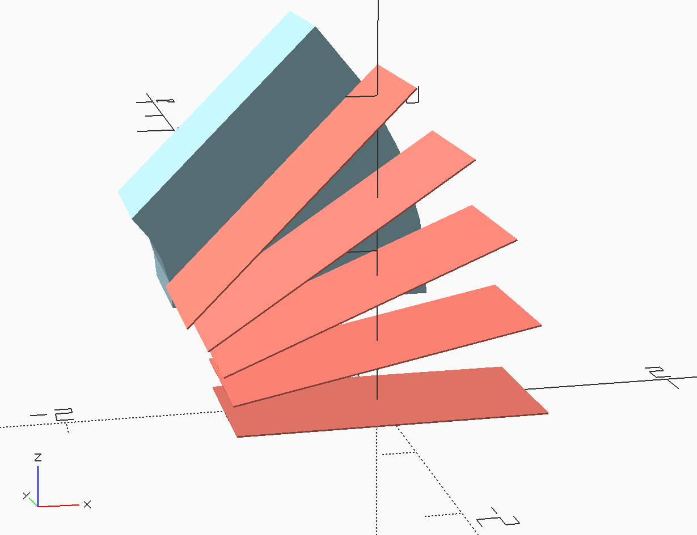
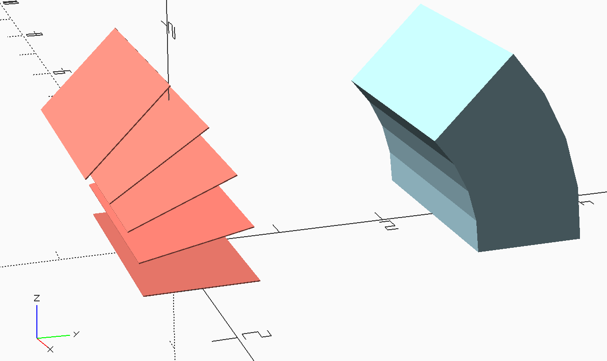
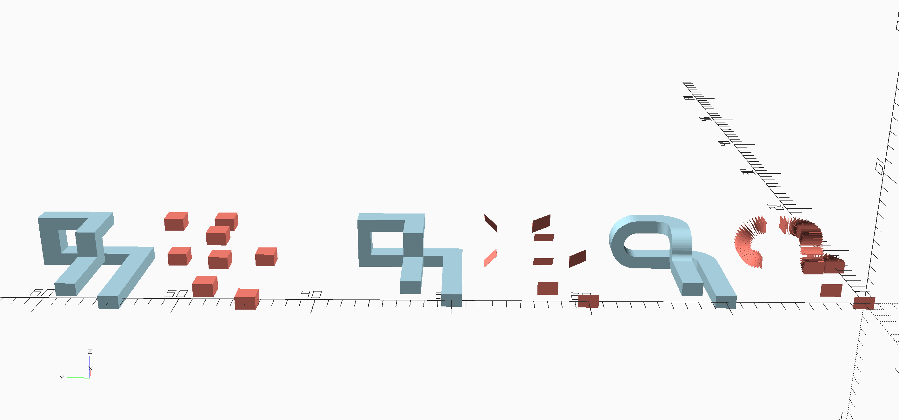
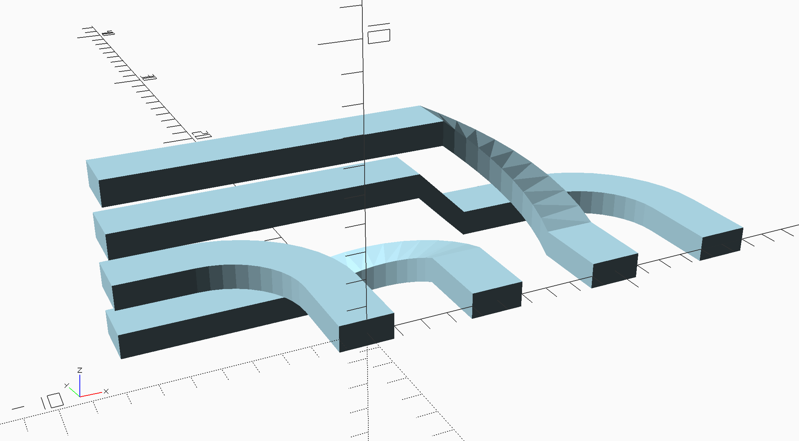
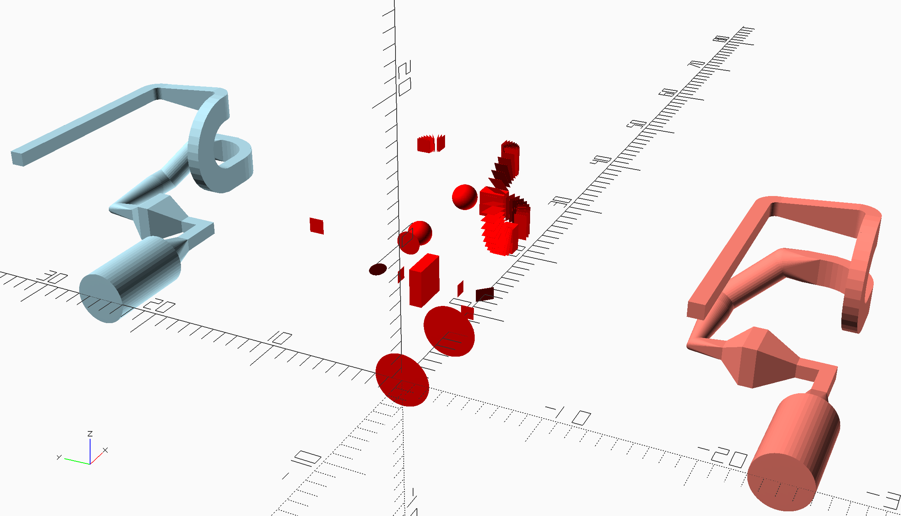
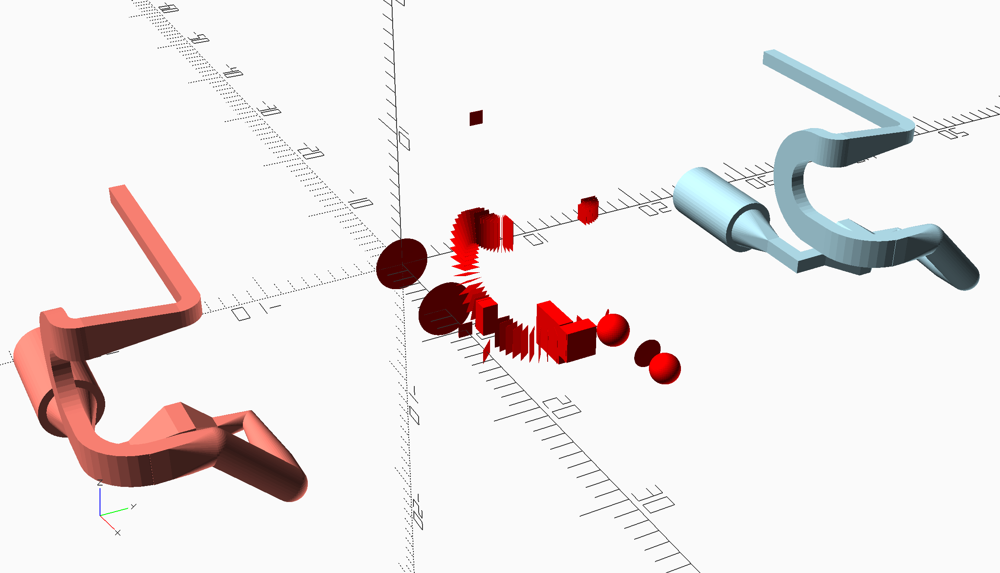
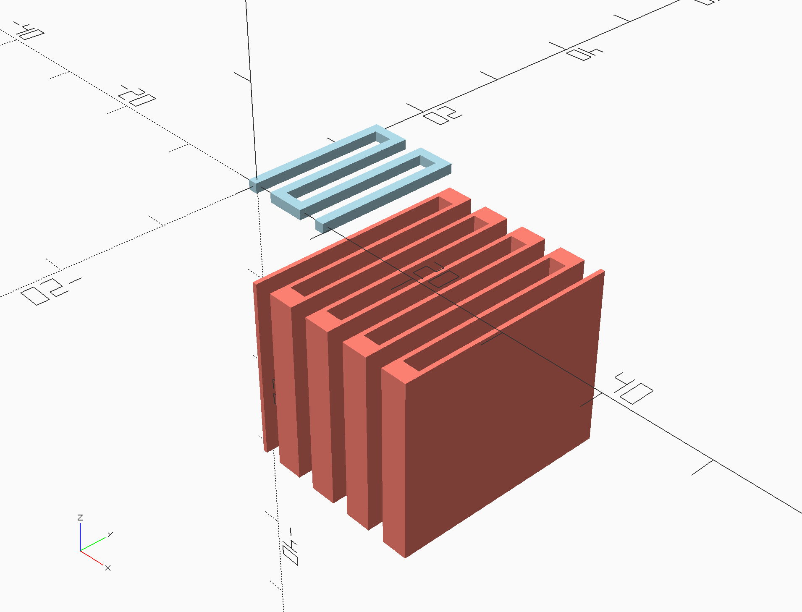
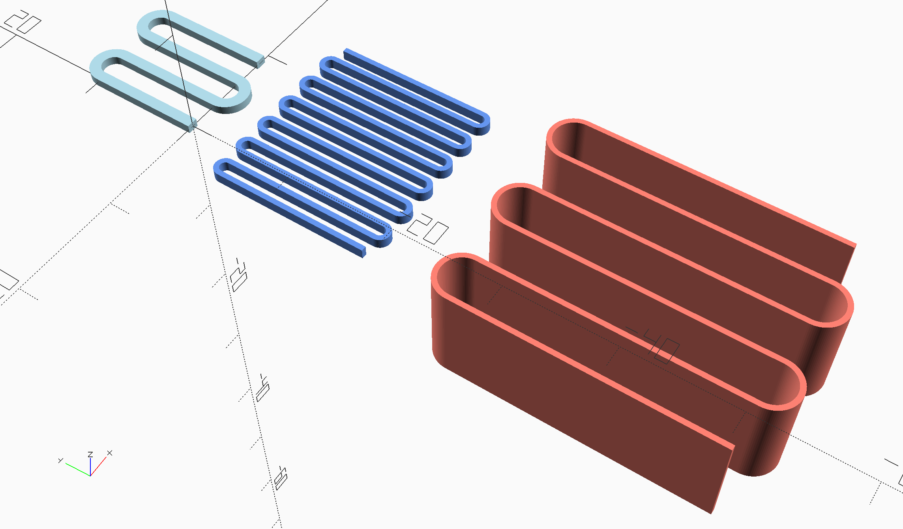

# Purpose

Helper modules to make the following microfluidic structures easier to include in Openscad device designs:

- Multi-segment channels (polychannel)
- Serpentine channels with 90&deg; bends
- Serpentine channels with 180&deg; arc connecting channels

# Usage

To use the modules in the openscad files below, put the desired file(s) in the same directory as your openscad project and put one or all the following line at the top of your openscad file, depending on which modules you need:

	use <polychannel.scad>
	use <serpentine.scad>
	use <serpentinecircularends.scad>

Absolutely do not use `include <polychannel.scad>`, etc. The reason is that `use` only imports the modules and functions whereas `include` executes all of the code in the included file, which will pollute your openscad model because each of these files can be run on its own to demonstrate how to use its modules. **Examples for how to use the code are included in each openscad file. Just look at the code in the file, which is reasonably documented, and run the file to see what the example code does and how to use it.**


# `polychannel.scad`

## Purpose

Make it easy to generate a variety of complex channel shapes using a sequential hull operation.

## Features

- Set up geometry with relative positions for each shape.
- Each shape is generated from either the Openscad `cube()` or `sphere()` module, and can be of arbitrary size in each of the x-y-z dimensions. This is particularly useful for creating flat shapes. See examples for use of flat shapes.
- The `hull()` operation is applied to sequential pairs of shapes to generate a channel.
- Circular arcs in xy, xz, and/or yz can be included with use of appropriate arc function.
	- `arc_xy_rel_position()`
	- `arc_xz_rel_position()`
	- `arc_yz_rel_position()`
- Various utility functions are provided.
	- `abs_to_rel_positions()`
	- `rel_to_abs_positions()`
	- `reverse_order()`
	- `get_final_position()`

## Shape/position data structure

Each line in a list of shapes/positions has the following format:

- `[<shape>, <size>, <relative position>, <rotation>]`
    - `<shape>` = "cube" or "sphere/sphr"
    - `<size>` = [3, 2, 1]
    - `<position>` = [10, 12, 0] can be absolute or relative, always specify as relative and then use function to turn it into absolute if needed
    - `<rotation>` &rarr; angle (a=90), axis of rotation (v=[0, 0, 1]) = [90, [0, 0, 1]]
- Example
    - `["sphr", [0.01, 4, 4], [0, 0, 0], [45, [0, 0, 1]]]`

## Notes on positions

- **A shape is centered on its position.** For example, the position of a 1x1x1 cube is the center of the cube (i.e., not one of its corners). This has important implications when you lay out a polychannel. If your starting shape is a 1x1x1 cube and you pick the origin as its position, realize that the cube spills over to -0.5 in x, y, and z. This may not be what you want when you are connecting the channel to something else. For this reason, it is often convenient to use a flat cube (or sphere), where the thin dimension is the one you want to connect to the face of some other component. Also note that you should always use a flat shape immediately preceding an arc, otherwise the first flat shape of the arc will be buried in the previous shape.
- The position for each shape is a position **relativew** to the previous shape. For example, if the relative position for a shape is [3, -2, 1] then it is positioned +3 units in x, -2 units in y, and 1 unit in z beyond the position of the previous shape.

## Minimal example

### Code

```
use <polychannel.scad>

eps = 0.01;
params_pos_relative = [
    ["sphr", [eps, 4, 4], [0, 0, 0], [0, [0, 0, 1]]],
    ["sphr", [eps, 4, 4], [7, 0, 0], [0, [0, 0, 1]]],
    ["sphr", [eps, 3, 3], [0, 0, 0], [0, [0, 0, 1]]], // Note relative position is zero; this line effectively just changes the size of the circle leaving it in the same place.
    ["cube", [eps, 0.5, 0.5], [3, 0, 0], [0, [0, 0, 1]]],
    ["cube", [0.5, 0.5, 0.5], [5, 0, 0], [0, [0, 0, 1]]],
    ["cube", [0.5, 0.5, 0.5], [0, 4, 0], [0, [0, 0, 1]]],
];
polychannel(params_pos_relative);
color("red") translate([0, 0, 5]) polychannel(params_pos_relative, show_only_shapes=true);

//Annotations
color("blue") translate([8,-4,0]) rotate([90,0,0]) scale(0.1) text("polychannel() output",halign="center",valign="center");
color("blue") translate([8,-4,5]) rotate([90,0,0]) scale(0.1) text("Shapes-only",halign="center",valign="center");
```

### Result




# Circular arc functions

The purpose of this section is to document the basic geometry for each arc function. In each case below, the shape at 0&deg; is what needs to be given to the arc function, which will then transform it to go from the starting angle, `angle1`, to the final angle, `angle2`, in the specified number of arc segments, `n`, and with radius, `radius`. The starting angle, `angle1` can be any angle, including but not limited to 0&deg;. Note that all angles are specified in degrees, not radians. Also, be careful of 360&deg; (2&pi;) ambiguities, which are not accounted for in the arc function implementations.

**Salmon color - features used for sequential hull operation.  
Light blue color - actual arc generated by applying sequential hull operation to salmon colored features.**

## Arc: 0&deg; - 45&deg; 

### x-y arc

```
use <polychannel.scad>

// Note: all examples use relative coordinates to specify shape positions.

eps = 0.01;
width = 2;
height = 1;

params_arc = [
    each arc_xy_rel_position("cube", [width, eps, height], radius=2, angle1=0, angle2=45, n=4),
];
polychannel(params_arc, clr="Salmon", show_only_shapes=true);
translate([0, 3, 0]) polychannel(params_arc);
```

0&deg; is in the xz plane, and positive rotation is CCW from the +x axis rotating around the +z axis (follows right-hand rule with thumb in the +z direction).




### x-z arc

```
params_arc = [
    each arc_xz_rel_position("cube", [width, height, eps], radius=2, angle1=0, angle2=45, n=4),
];
polychannel(params_arc, clr="Salmon", show_only_shapes=true);
translate([0, 3, 0]) polychannel(params_arc);
```

0&deg; is in the xy plane, and positive rotation is CCW from the +x axis rotating around the -y axis (to maintain right-hand rule, thumb in the -y direction).



### y-z arc

```
params_arc = [
    each arc_yz_rel_position("cube", [width, height, eps], radius=2, angle1=0, angle2=45, n=4),
];
polychannel(params_arc, clr="Salmon", show_only_shapes=true);
translate([0, 3, 0]) polychannel(params_arc);
```

0&deg; is in the xy plane, and positive rotation is CCW from the +y axis rotating around the +x axis (follows right-hand rule with thumb in the +x direction).




# Channel with 90&deg; bends

## Purpose

Illustrate 3 different ways of doing 90&deg; bends:

- Rectangular blocks
- Flat plates rotated 45&deg;
- Circular arcs

## Code

```
use <polychannel.scad>

// Note: all examples use relative coordinates to specify shape positions.

eps = 0.01;
x_vec = [1, 0, 0];
y_vec = [0, 1, 0];
z_vec = [0, 0, 1];

// Simple rectangular straight channels and 90deg bends.
width_90bends = 1.5;
height_90bends = 1;
size_90bends = [width_90bends, width_90bends, height_90bends];
params_90bends = [
    ["cube", size_90bends, [0, 0, 0], [0, z_vec]],
    ["cube", size_90bends, [8, 0, 0], [0, z_vec]],
    ["cube", size_90bends, [0, 7, 0], [0, z_vec]],
    ["cube", size_90bends, [0, 0, 3], [0, z_vec]],
    ["cube", size_90bends, [0, -4, 0], [0, z_vec]],
    ["cube", size_90bends, [-3, 0, 0], [0, z_vec]],
    ["cube", size_90bends, [0, 0, -2], [0, z_vec]],
    ["cube", size_90bends, [-5, 0, 0], [0, z_vec]],
];
translate([0, 45, 0]) {
    polychannel(params_90bends, clr="Salmon", show_only_shapes=true);
    translate([0, 10, 0]) polychannel(params_90bends);
};

// Similar but use thin shapes.
params_90bends_thin = [
    ["cube", [eps, width_90bends, height_90bends], [0, 0, 0], [0, z_vec]],
    ["cube", [eps, width_90bends*sqrt(2), height_90bends], [8, 0, 0], [45, z_vec]],
    ["cube", [width_90bends, eps, height_90bends*sqrt(2)], [0, 7, 0], [45, x_vec]],
    ["cube", [width_90bends, eps, height_90bends*sqrt(2)], [0, 0, 3], [-45, x_vec]],
    ["cube", [eps, width_90bends*sqrt(2), height_90bends], [0, -4, 0], [45, z_vec]],
    ["cube", [eps, width_90bends, height_90bends*sqrt(2)], [-3, 0, 0], [-45, y_vec]],
    ["cube", [eps, width_90bends, height_90bends*sqrt(2)], [0, 0, -2], [-45, y_vec]],
    ["cube", [eps, width_90bends, height_90bends], [-5, 0, 0], [0, z_vec]],
];
translate([0, 20, 0]) {
    polychannel(params_90bends_thin, clr="Salmon", show_only_shapes=true);
    translate([0, 10, 0]) polychannel(params_90bends_thin);
};

// Similar but use circular arcs.
n_segs90 = 12;
radius90 = 1.5;
params_90bends_arcs = [
    ["cube", [eps, width_90bends, height_90bends], [0, 0, 0], [0, z_vec]],
    ["cube", [eps, width_90bends, height_90bends], [6.5, 0, 0], [0, z_vec]],
    each arc_xy_rel_position("cube", [width_90bends, eps, height_90bends], radius90, -90, 0, n_segs90),
    ["cube", [width_90bends, eps, height_90bends], [0, 4, 0], [0, z_vec]],
    each arc_yz_rel_position("cube", [width_90bends, height_90bends, eps], radius90, -90, 90, 2*n_segs90),
    ["cube", [width_90bends, eps, height_90bends], [0, -1.5, 0], [0, z_vec]],
    each arc_xy_rel_position("cube", [width_90bends, eps, height_90bends], radius90, 0, -90, n_segs90),
    ["cube", [eps, width_90bends, height_90bends], [-0.5, 0, 0], [0, z_vec]],
    each arc_xz_rel_position("cube", [height_90bends, width_90bends, eps], radius90/1.5, 90, 180, n_segs90),
    each arc_xz_rel_position("cube", [height_90bends, width_90bends, eps], radius90/1.5, 0, -90, n_segs90),
    ["cube", [eps, width_90bends, height_90bends], [-4, 0, 0], [0, z_vec]],
];
translate([0, 0, 0]) {
    polychannel(params_90bends_arcs, clr="Salmon", show_only_shapes=true);
    translate([0, 10, 0]) polychannel(params_90bends_arcs);
};
```

## Result



# Ascend/descend relative position modification

## Code

```
use <polychannel.scad>

eps = 0.01;
base_arc_xy = arc_xy_rel_position("cube", [2, eps, 1], radius=4, angle1=0, angle2=90, n=10);
chan1 = [
    ["cube", [2, eps, 1], [0, 0, 0], [0, [0, 0, 1]]],
    ["cube", [2, eps, 1], [0, 3, 0], [0, [0, 0, 1]]],
    each base_arc_xy,
    ["cube", [eps, 2, 1], [-3, 0, 0], [0, [0, 0, 1]]],
];
polychannel(chan1);
echo(get_final_position(chan1));

chan2 = [
    ["cube", [2, eps, 1], [0, 0, 0], [0, [0, 0, 1]]],
    ["cube", [2, eps, 1], [0, 3, 0], [0, [0, 0, 1]]],
    each uniformly_increase_rel_pos_in_z(base_arc_xy, -2),
    ["cube", [eps, 2, 1], [-8, 0, 0], [0, [0, 0, 1]]],
];
translate([5, 0, 0])
    polychannel(chan2);

chan3 = [
    ["cube", [2, eps, 1], [0, 0, 0], [0, [0, 0, 1]]],
    ["cube", [2, eps, 1], [0, 3, 0], [0, [0, 0, 1]]],
    each uniformly_increase_rel_pos_in_z(base_arc_xy, 4),
    ["cube", [eps, 2, 1], [-13, 0, 0], [0, [0, 0, 1]]],
];
translate([10, 0, 0])
    polychannel(chan3);

chan4 = [
    ["cube", [2, eps, 1], [0, 0, 0], [0, [0, 0, 1]]],
    ["cube", [2, eps, 1], [0, 3, 0], [0, [0, 0, 1]]],
    each base_arc_xy,
    ["cube", [eps, 2, 1], [-4, 0, 0], [0, [0, 0, 1]]],
    ["cube", [eps, 2, 1], [-2, 0, 2], [0, [0, 0, 1]]],
    ["cube", [eps, 2, 1], [-12, 0, 0], [0, [0, 0, 1]]],
];
translate([15, 0, 0])
    polychannel(chan4);
```

## Result



# Channel with general shapes

## Code

```
use <polychannel.scad>

// Note: all examples use relative coordinates to specify shape positions.

eps = 0.01;

params_pos_relative = [
    ["sphr", [eps, 4, 4], [0, 0, 0], [0, [0, 0, 1]]],
    ["sphr", [eps, 4, 4], [7, 0, 0], [0, [0, 0, 1]]],
    ["sphr", [eps, 3, 3], [0, 0, 0], [0, [0, 0, 1]]],
    ["cube", [eps, 1, 1], [3, 0, 0], [0, [0, 0, 1]]],
    ["cube", [eps, 1*sqrt(2), 1], [3, 0, 0], [45, [0, 0, 1]]],
    ["cube", [eps, 1, 1], [0, 2, 0], [90, [0, 0, 1]]],
    ["cube", [3, 1, 3], [0, 3, 0], [0, [0, 0, 1]]],
    ["cube", [1, eps, 1], [0, 2, 0], [0, [0, 0, 1]]],
    ["sphr", [eps, 1*sqrt(2), 1], [0, 2, 0], [45, [0, 0, 1]]],
    ["sphr", [eps, 2, 2], [5, 0, 0], [0, [0, 0, 1]]],
    ["sphr", [2, 2, 2], [2, 0, 0], [0, [0, 0, 1]]],
    ["sphr", [2, 2, 2], [0, -4, 4], [0, [0, 0, 1]]],
    ["cube", [1, eps, 2], [0, -3, 0], [0, [0, 0, 1]]],
    each arc_xy_rel_position("cube", [1, eps, 2], radius=3, angle1=0, angle2=-90, n=10),
    ["cube", [1, 1, 2], [-2, 0, 0], [0, [0, 0, 1]]],
    each arc_xz_rel_position("cube", [2, 1, eps], radius=3, angle1=-90, angle2=-270, n=20),
    each arc_xy_rel_position("cube", [1, eps, 2], radius=1, angle1=-90, angle2=0, n=10),
    ["cube", [1, eps, 1], [0, 5, 0], [0, [0, 0, 1]]],
    each arc_xy_rel_position("cube", [1, eps, 1], radius=1, angle1=0, angle2=90, n=10),
    ["cube", [eps, 1, 1], [-15, 0, 0], [0, [0, 0, 1]]],
];
params_pos_absolute = rel_to_abs_positions(params_pos_relative);

polychannel(params_pos_relative, clr="red", show_only_shapes=true);
translate([0, 25, 0]) polychannel(params_pos_absolute, relative_positions=false);
translate([0, -25, 0]) polychannel(params_pos_relative, clr="Salmon");
```

## Result

  
  


# `serpentine_channel()`




Schematic illustration of the geometry used for a serpentine channel and how the algorithm works by using relative positioning coordinates in conjunction with the `polychannel()` module. In the graph, the numbered green blocks (0-7) are the 3D shapes that are used in the sequential hull operation to generate the serpentine channel. The main point of the algorithm is simply calculating the relative positions of these blocks.


# `serpentine_channel_circ()`




