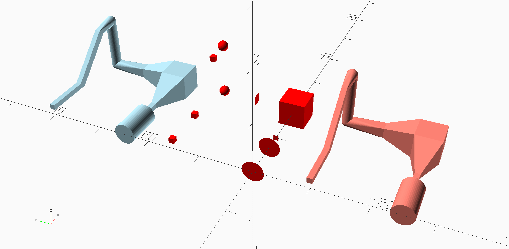

## Purpose

Helper modules to make the following microfluidic structures easier to include in Openscad device designs:

- Multi-segment channels (polychannel)
- Serpentine channels with 90&deg; bends
- Serpentine channels with 180o&deg; arc connecting channels

## Usage

To use the modules in the openscad files below, put the desired file(s) in the same directory as your openscad project and put one or all the following line at the top of your openscad file, depending on which modules you need:

	use <polychannel.scad>
	use <serpentine.scad>
	use <serpentinecircularends.scad>

Absolutely do not use `include <polychannel.scad>`, etc. The reason is that `use` only imports the modules and functions whereas `include` executes all of the code in the included file, which will pollute your openscad model because each of these files can be run on its own to demonstrate how to use its modules. **Examples for how to use the code are included in each openscad file. Just look at the code in the file, which is reasonably documented, and run the file to see what the example code does and how to use it.**

## `polychannel()`

The `polychannel` module is a much easier to use replacement for Jose's `routing` library, and is based on Openscad's [hull() operation](https://en.wikibooks.org/wiki/OpenSCAD_User_Manual/Transformations#hull). If you don't know what that is, please go through material at the link. Once you understand it, the module should be easy to use.

Note that the red rectangular boxes are the shapes on which the `hull()` operation operates to get the pale red (absolute positioning) and light blue (relative positioning) polychannels.

## `serpentine_channel()`

Schematic illustration of the geometry used for a serpentine channel and how the algorithm works by using relative positioning coordinates in conjunction with the `polychannel()` module. In the graph, the numbered green blocks (0-7) are the 3D shapes that are used in the sequential hull operation to generate the serpentine channel. The main point of the algorithm is simply calculating the relative positions of these blocks.

## `serpentine_channel_circ()`

