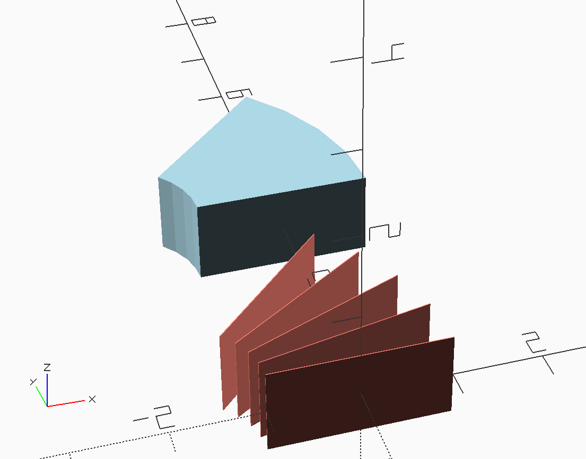
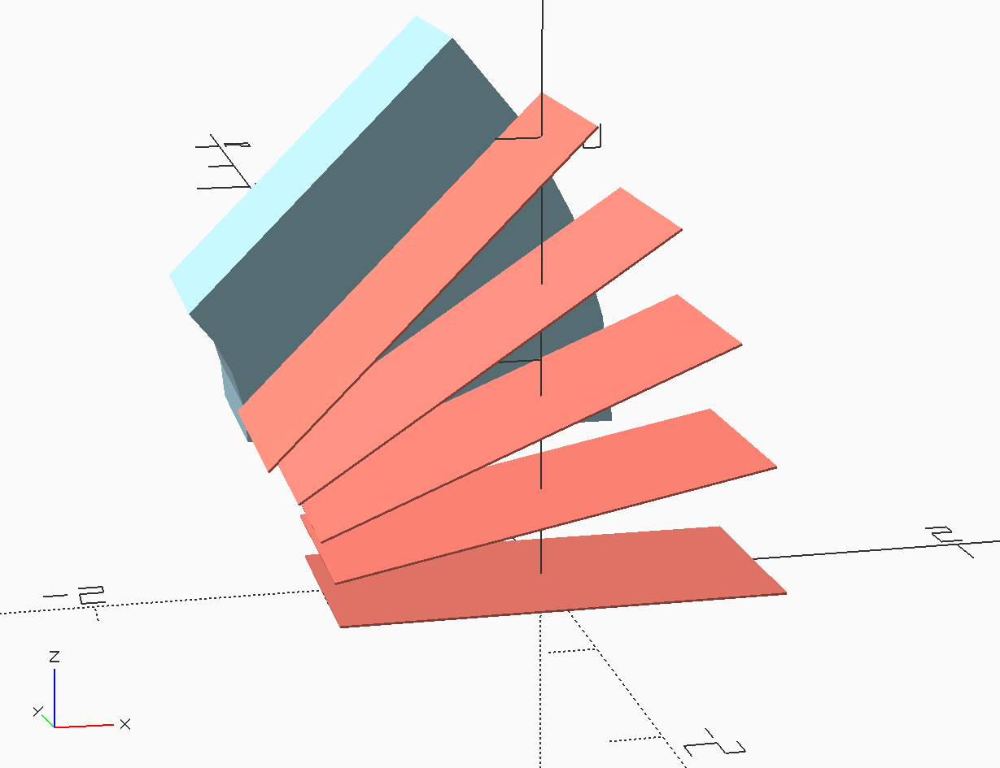
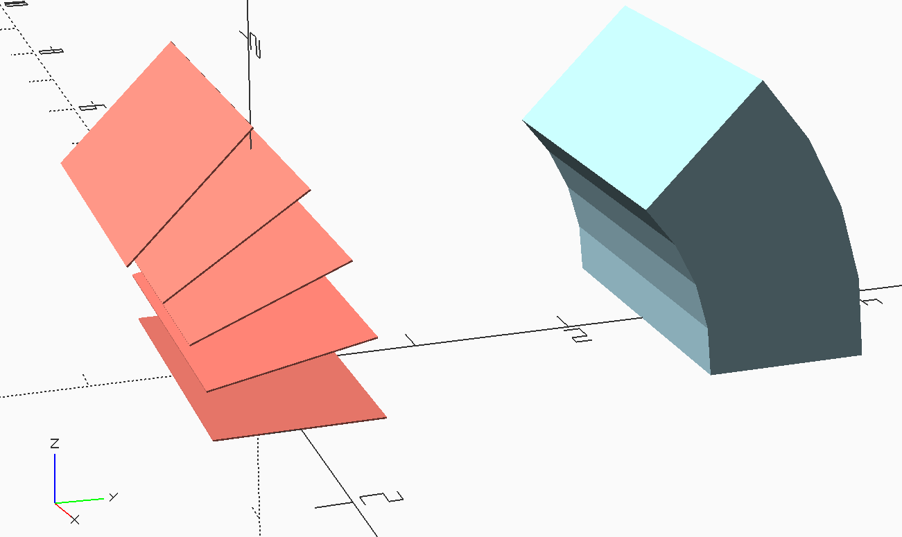

# Purpose

Document basic geometry for arc functions. In each case below, the shape at 0&deg; is what needs to be given to the arc function, which will then transform it to go from the starting angle, `angle1`, to the final angle, `angle2`, in the specified number of arc segments, `n`, and with radius, `radius`.

# Arc: 0&deg; - 45&deg; 

## x-y arc

```
use <polychannel.scad>

// Note: all examples use relative coordinates to specify shape positions.

eps = 0.01;
width = 2;
height = 1;

params_arc = [
    each arc_yz_rel_position("cube", [width, height, eps], radius=2, angle1=0, angle2=45, n=4),
];
polychannel(params_arc, clr="Salmon", show_only_shapes=true);
translate([0, 3, 0]) polychannel(params_arc);
```

0&deg; is in the xz plane, and positive rotation is CCW from the +x axis rotating around the +z axis (follows right-hand rule with thumb in the +z direction).




## x-z arc

```
params_arc = [
    each arc_xz_rel_position("cube", [width, height, eps], radius=2, angle1=0, angle2=45, n=4),
];
polychannel(params_arc, clr="Salmon", show_only_shapes=true);
translate([0, 3, 0]) polychannel(params_arc);
```

0&deg; is in the xy plane, and positive rotation is CCW from the +x axis rotating around the -y axis (to maintain right-hand rule, thumb in the -y direction).



## y-z arc

```
params_arc = [
    each arc_yz_rel_position("cube", [width, height, eps], radius=2, angle1=0, angle2=45, n=4),
];
polychannel(params_arc, clr="Salmon", show_only_shapes=true);
translate([0, 3, 0]) polychannel(params_arc);
```

0&deg; is in the xy plane, and positive rotation is CCW from the +y axis rotating around the +x axis (follows right-hand rule with thumb in the +x direction).


