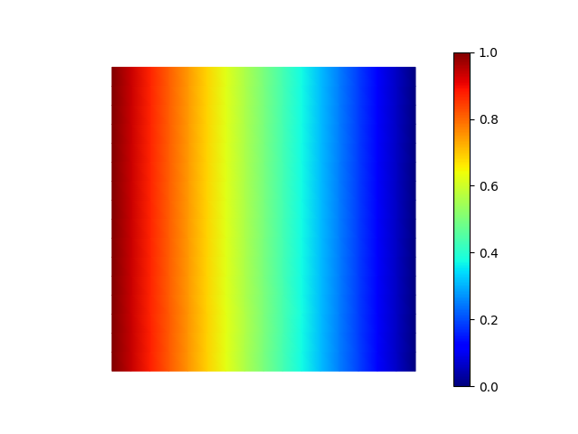

# Purpose

Try latest `panel` version with jupyterlab.

# Info

- [scikit-fem](https://github.com/kinnala/scikit-fem?tab=readme-ov-file)

  - > `scikit-fem` is a pure Python 3.8+ library for performing [finite element assembly](https://en.wikipedia.org/wiki/Finite_element_method). Its main purpose is the transformation of bilinear forms into sparse matrices and linear forms into vectors.

  - Text of [paper](https://github.com/kinnala/scikit-fem/blob/master/paper/paper.md)
  - [List of examples](https://github.com/kinnala/scikit-fem/blob/master/docs/listofexamples.rst)

# Next

- &#9989; Poisson equation with mixed boundary conditions.
- &#9989; Rectangular shape computation region.
- Add spatially-dependent source function.
- Solve time-dependent diffusion case.

# Log

## Fri, 4/5/24

### Rectangular mesh regions

See `meshes/meshes-rectangular.ipynb`, which uses the mesh `.init_tensor` method documented at [Class: MeshTri](https://scikit-fem.readthedocs.io/en/latest/api.html#class-meshtri).

### Mixed boundary conditions

Start with `ex01.py` as `mixed_BCs/ex01_mixed_BCs.py` and modify so fixed field is 0.0 and to have mixed BCs:

- top & bottom: Neumann, 0
- left & right: Dirichlet, 1 & 0

#### Solution - code snippets

```python
# create 2D mesh and associated basis, both have default boundaries defined as "left", "right", "top", "bottom"
mesh = MeshTri().refined(4)
basis = Basis(mesh, ElementTriP1())

# Create left and right hand sides of weak formulation
@BilinearForm
def laplace(u, v, _):
    return dot(grad(u), grad(v))
@LinearForm
def rhs(v, _):
    return 0.0 * v
A = laplace.assemble(basis)
b = rhs.assemble(basis)

# Boundary conditions

# Create temporary array of nodes "u" and set boundary node values for desired Dirichlet BCs.
# In this case we want "left" to be 1.0 and "right" to be 0.0 (which it already is because of how we created "u")
u = basis.zeros()
u[basis.get_dofs("left")] = 1.0

# Add BCs to A and b. 
# "x=u" sets the boundary values for the boundaries specified with "D=...".
# All boundaries not specified with "D=..." have Neumann BC equal to 0.
# If a desired flux is needed at a boundary, check out Example 24 that has a parabolic velocity flow at an inlet.
A, b = enforce(A, b, x=u, D=basis.get_dofs(["left", "right"]))

```

#### Result



## Thu, 4/4/24

### Create environment

```bash
micromamba create -n scikit-fem python ipykernel
micromamba activate scikit-fem
pip install scikit-fem[all]
python -m ipykernel install --user --name scikit-fem --display-name="scikit-fem"
```

### Try Examples 1, 7, 13

Files: `ex01.py`, `ex07.py`, `ex13.py`

- Each file runs and produces output.
- I can look at the vtk output file from the first example, but was unable to produce output files for the other two examples &rarr; I need to understand the classes and their content and structure.

### Look at mesh and basis

- Create `meshes.ipynb` and look at `MeshTriP1` and `MeshQuad1` with first order elements.

### Mixed Dirichlet & Neumann BCs

Example 13 uses `skfem.condense()` to create a condensed linear system. Executing `help(condense)` in notebook gives a really useful explanation:

```python
Help on function condense in module skfem.utils:

condense(A: scipy.sparse._matrix.spmatrix, b: Union[numpy.ndarray, scipy.sparse._matrix.spmatrix, NoneType] = None, x: Optional[numpy.ndarray] = None, I: Union[numpy.ndarray, skfem.assembly.dofs.DofsView, Dict[str, skfem.assembly.dofs.DofsView], NoneType] = None, D: Union[numpy.ndarray, skfem.assembly.dofs.DofsView, Dict[str, skfem.assembly.dofs.DofsView], NoneType] = None, expand: bool = True) -> Union[scipy.sparse._matrix.spmatrix, Tuple[scipy.sparse._matrix.spmatrix, numpy.ndarray], Tuple[scipy.sparse._matrix.spmatrix, scipy.sparse._matrix.spmatrix], Tuple[scipy.sparse._matrix.spmatrix, numpy.ndarray, numpy.ndarray], Tuple[scipy.sparse._matrix.spmatrix, numpy.ndarray, numpy.ndarray, numpy.ndarray], Tuple[scipy.sparse._matrix.spmatrix, scipy.sparse._matrix.spmatrix, numpy.ndarray, numpy.ndarray]]
    Eliminate degrees-of-freedom from a linear system.

    The user should provide the linear system ``A`` and ``b``
    and either the set of DOFs to eliminate (``D``) or the set
    of DOFs to keep (``I``).  Optionally, nonzero values for
    the eliminated DOFs can be supplied via ``x``.

    .. note::

        Supports also generalized eigenvalue problems
        where ``b`` is a matrix.

    Example
    -------

    Suppose that the solution vector :math:`x` can be
    split as

    .. math::

       x = \begin{bmatrix}
           x_I\\
           x_D
       \end{bmatrix}

    where :math:`x_D` are known and :math:`x_I` are unknown.  This allows
    splitting the linear system as

    .. math::

       \begin{bmatrix}
           A_{II} & A_{ID}\\
           A_{DI} & A_{DD}
       \end{bmatrix}
       \begin{bmatrix}
           x_I\\
           x_D
       \end{bmatrix}
       =
       \begin{bmatrix}
           b_I\\
           b_D
       \end{bmatrix}

    which leads to the condensed system

    .. math::

       A_{II} x_I = b_I - A_{ID} x_D.


    As an example, let us assemble the matrix :math:`A` and the vector
    :math:`b` corresponding to the Poisson equation :math:`-\Delta u = 1`.

    .. doctest::

       >>> import skfem as fem
       >>> from skfem.models.poisson import laplace, unit_load
       >>> m = fem.MeshTri().refined(2)
       >>> basis = fem.CellBasis(m, fem.ElementTriP1())
       >>> A = laplace.assemble(basis)
       >>> b = unit_load.assemble(basis)

    The condensed system is obtained with :func:`skfem.utils.condense`.  Below
    we provide the DOFs to eliminate via the keyword argument
    ``D``.

    .. doctest::

       >>> AII, bI, xI, I = fem.condense(A, b, D=m.boundary_nodes())
       >>> AII.toarray()
       array([[ 4.,  0.,  0.,  0., -1., -1., -1., -1.,  0.],
              [ 0.,  4.,  0.,  0., -1.,  0., -1.,  0.,  0.],
              [ 0.,  0.,  4.,  0.,  0., -1.,  0., -1.,  0.],
              [ 0.,  0.,  0.,  4., -1., -1.,  0.,  0.,  0.],
              [-1., -1.,  0., -1.,  4.,  0.,  0.,  0.,  0.],
              [-1.,  0., -1., -1.,  0.,  4.,  0.,  0.,  0.],
              [-1., -1.,  0.,  0.,  0.,  0.,  4.,  0., -1.],
              [-1.,  0., -1.,  0.,  0.,  0.,  0.,  4., -1.],
              [ 0.,  0.,  0.,  0.,  0.,  0., -1., -1.,  4.]])
        >>> bI
        array([0.0625, 0.0625, 0.0625, 0.0625, 0.0625, 0.0625, 0.0625, 0.0625,
               0.0625])

    By default, the eliminated DOFs are set to zero.
    Different values can be provided through the keyword argument ``x``;
    see :ref:`ex14`.

    Parameters
    ----------
    A
        The system matrix
    b
        The right hand side vector, or zero if x is given, or the mass matrix
        for generalized eigenvalue problems.
    x
        The values of the condensed degrees-of-freedom. If not given, assumed
        to be zero.
    I
        The set of degree-of-freedom indices to include.
    D
        The set of degree-of-freedom indices to dismiss.
    expand
        If ``True`` (default), returns also `x` and `I`. As a consequence,
        :func:`skfem.utils.solve` will expand the solution vector
        automatically.

    Returns
    -------
    CondensedSystem
        The condensed linear system and (optionally) information about
        the boundary values.
```

These lines implement setting Dirichlet BC u(y=0) = 0 ("ground" side of mesh) and u(y=...) = 1.0 ("positive" side of mesh):

```python
# Create an array of the right shape that is filled with zeros
u = basis.zeros()

# Select the "positive" edge of the space and set to 1.0
u[basis.get_dofs("positive")] = 1.0

# condense the system and then solve the system
u = solve(*condense(A, x=u, D=basis.get_dofs({"positive", "ground"})))

```


