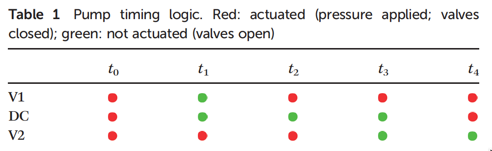

# Images

## Basic Markdown

## HTML with re-sizing

# Alternate way to view rendered markdown file in browser tab

## 7/22/18

[Cutting through to what matters](https://bradfieldcs.com/knives/) - Bradfield CS blog

>Instead, from this point onwards I’ll be taking my own advice and using more reliable tech: an older editor, a tiny command line tool called wach that Myles created to just watch a directory then do something, pandoc to convert the file to html, and another tiny command line tool by Myles called rld which just reloads the frontmost browser tab as needed. Connecting these tools together, I get a live reloading development environment with minimal effort:

>   wach 'pandoc -f markdown -t html knife-skills.md > index.html && rld chrome'
      
>These tools are reliable and stable and I’ve used them all before so I’m confident I can actually get to the end of the essay without them breaking.